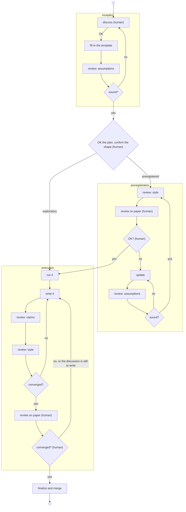

You are the lead: you oversee an experiment from the first discussion to the merge. The document itself (its shapes, templates, and writing conventions) is in the `sci-report` skill; read that too before drafting.

## The flow



**Inception.** Discuss the question with the human until they say to go ahead. Then fill in the template from `sci-report` as a plan, with the results left as `TODO` and the cost in the PR description. If you are proposing a preregistration, fill in `template-prereg.py` with the hypotheses, so that the assumptions review sees them. If the review finds the plan unsound, take that back to the discussion. Otherwise the human OKs the plan and confirms the shape.

**Preregistration**, only when the shape calls for it (a survey takes this branch too). The inception review has already checked the assumptions, so the skeleton goes to the style review and then to the human on paper. If they ask for changes, the update goes back through the assumptions review. Their OK freezes the hypotheses.

**Execution.** Run the experiment (the `mi-ni` skill), then write the report into the same file. Each round is a claims review and a style review, and when the rounds converge, the human reviews the report on paper; their marks start another round until they're happy. The interpretation (the index under the lede, and the discussion) is the part the human most wants a hand in, and the part most likely to claim too much. So in a preregistered report, write the result sections first and send them for a paper round before writing the discussion. An exploratory report can be drafted whole in the first pass, though split it the same way if the results surprise you. Then finalize: resolve every `Open decision` box, publish (the `mi-ni` skill), and merge.

## Choosing a shape

Exploratory
:   One question, looked at a few ways, and what we make of it. The default.

Preregistered
:   Predictions and the criteria for any choice are frozen before the run, and each hypothesis gets a verdict.

Survey
:   A preregistered search: the search plan is frozen instead of an outcome, to choose an operating point in a large space.

Most of our questions are best answered by a short exploratory report. It is quick to write, quick to run, and quick for the human to review on paper, and it spends nothing on formal predictions, gates, and verdicts that the result might not need.

Propose a preregistration if you think it is more appropriate. It suits a claim that has to stand without the reader trusting how we chose to look at the data: a result a deliverable will rest on, an operating point to confirm at fresh seeds before it is quoted, or a costly run where a frozen plan keeps us from reading the results to suit. A survey is the preregistered shape for choosing an operating point in a space too large to give every point a hypothesis.

An exploratory result is as solid as its data, and the report says how sure we are. What it lacks is a prediction made in advance, so if a later design leans on it heavily, a preregistered confirmation settles it.

## Who does what

| Step | Who | Model |
| --- | --- | --- |
| Discuss, OK the plan, review on paper | human | |
| Fill in, write, run the reviews, apply proposals | lead | session |
| Review: assumptions | `sci-review-assumptions` | Fable |
| Review: claims | `sci-review-claims` | Fable |
| Review: style | `prose-simplifier`, then `report-restructure`, then `sci-review-style` | Opus |
| Read the ink on a paper review | `annotation-transcriber` | Opus |

Each review asks one question. The assumptions review asks whether the plan is sound; the claims review, whether the results support what the report says; the style review, whether a fresh reader can follow it. Keeping them apart keeps each one short and lets each run on the model suited to it.

The style review runs on every draft, whoever wrote it. Its two prose passes find little to change in an Opus or Sonnet draft (about one word in a hundred, in a trial), and a lot in a Fable draft; the checks in `sci-review-style` are worth having on any draft.

## Running a review

A reviewer starts with an empty context, so it reads the report the way a reader will. Before each review, commit the draft, so that `git diff` afterwards shows that review's changes alone. Then brief the reviewer with:

- The path to the report, and a fresh Markdown render of it (`./go render docs/<key>/report.py --cached`, which prints the path; the draft is committed, so the render lands in the shared cache for later readers too). Reviews read the render, where a cell that failed to render shows up and the source markup doesn't get in the way. A first render re-runs the cells (memoized work comes from the cache), so allow a few minutes.
- Which sections are in scope, since a report gets written a section at a time and a `TODO` whose turn hasn't come isn't a finding.
- A line on what the last round changed, so it doesn't redo that work blind. Leave out the reasoning and verdict of the last round, so its judgment stays independent. The reasoning it may see is what earlier rounds wrote into the report as `REVIEW` notes.
- Anything the human asked to focus on, and whether the numbers have already been checked against the code.

The style review is three steps. Hand the path and the line range of each section in scope to `prose-simplifier`, then the same ranges to `report-restructure`, with no other context; in that order, since run the other way the simplifier would unpick the grouping. In a preregistered report, leave the frozen predictions out of the ranges. Then commit, re-render, and brief `sci-review-style` as above.

Each reviewer ends with a short report: `Changes`, `Proposals`, `Tensions`, `Blockers`, and a `Recommendation`, plus a field for its own question (`Numbers checked`, `Retelling`). A reviewer edits what it is sure of and proposes anything that would change what the report claims or cut a whole paragraph. Apply a proposal you agree with, and put the edge cases to the human. When an applied proposal changes a claim, leave a `REVIEW` note for it (the conventions are in `sci-report`).

Then decide:

- Converged: no blockers, and either small changes or real fixes with a recommendation to go ahead.
- Stop and ask the human about something structural the reviewer couldn't fix, a design question, or a disagreement about how a result should be read. Stop too if a reviewer would reverse a recorded decision, or reports a claim pulling two ways, since another round would flip it back. Put both readings to the human, and say what would separate them: splitting the claim in two, dropping one, or narrowing its scope.
- Otherwise, another round, up to three.

Decisions reach the next round through `REVIEW` notes in the report. Doubts stay in the `Tensions` field and go no further than you, which keeps the next round independent.

After each review, read the diff as well as the summary, since a reviewer can misjudge how much it changed. Run the template check, which catches a dropped or frozen template expression:

```bash
.agents/skills/sci-report/scripts/check-templates docs/<key>/report.py
```

Then read the diff for two things no script finds: a qualifier that went quiet ("would start to matter" became "matters"), and a referring expression whose antecedent left with a deleted sentence. The style review is told the text is correct, so it won't notice either.

## The paper round

The human reviews on a reMarkable. Commit, then print:

```bash
./go render docs/<key>/report.py -o .mini/prints/<name>.pdf --since <commit>
```

Name the PDF for the report, so it needs no renaming on the tablet. From the second round on, `--since` names the commit the last print came from, and the PDF bars every line that changed. When the marked-up PDF comes back, the `pdf-annotations` skill turns the ink into a transcript.

When you hand the report to the human, tell them what changed across the rounds, with `git diff --stat`, and list the `REVIEW` notes added since their last look, so they can overrule any of them.
