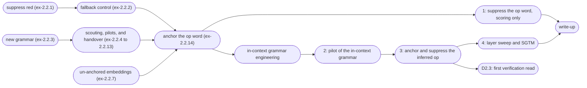

# D2.2 design: anchoring an operation, and the first interventions

A plan for the second deliverable of M2, laid out several ways: the claims we want to be able to make, the experiments in order, the engineering that has to come first, the risks each experiment retires, and what is out of scope.

*Note, 2026-09-25.* The [pivot](pivot.md) is adopted: after ex-2.2.14, D2.2 anchors an op the model infers from solved examples in its context, with no word to name it. The prep sections below record the work that led there. The plan from [anchor an inferred operation](#anchor-an-inferred-operation) on is written for the new grammar, and the [quick route](#quick-route) puts it in order.

Inputs: the D2.1 close-out ([ex-2.1.11](../ex-2.1.11/report.py), [ex-2.1.12](../ex-2.1.12/report.py), and the [post](/references/d2.1-anchored-transformer.md)), the first D2.2 result ([ex-2.2.1](../ex-2.2.1/report.py)), the anchored-op smoke test ([ex-2.2.14](../ex-2.2.14/report.py)), the D2.2-tagged backlog (`./go todo --tag D2.2`), the D2.1 kickoff lessons carried over from the autoencoders, and the [related-work delta](/references/related-work-delta-2026.md).

## What we want to be able to say

1. **Anchoring generalizes past a token attribute.** _Red_ is a property of the token at a known position. An _operation_ is a property of the computation: its evidence is spread over the solved examples in the context, and its use is at the query `=` and after, deeper in the stack. D2.2 is where we find out whether the anchor captures more than the identity of a token at a labelled site.
2. **Suppressing the anchor removes the ability, and the removal is graded and selective.** In M1 this had three parts: a dose-response curve, selectivity (orthogonal colors untouched), and an analytic bound the observed damage approached.
3. **The side-effects were boundable before intervening.** Post-hoc methods now bound side-effects too, estimated from emergent geometry (COAST, arXiv:2605.01167; pre-intervention prediction, arXiv:2606.08365). SCA's distinctive claim is that its bound holds by construction, because the geometry was placed.

**D2.1 never ran an intervention.** The first suppression of a transformer was [ex-2.2.1](../ex-2.2.1/report.py), on the _red_ checkpoints already in the store; the second claim now has its first transformer data, and the third its write-bound half.

## Quick route

We will likely run more experiments than this plan lists, and each one takes days to prepare, run, and review. Compute is cheap next to a review round, so the route keeps the number of rounds small, following four rules:
**(a)** add arms rather than rounds, including arms that pay off only if something goes wrong;
**(b)** ask a question of stored checkpoints before training for it, as ex-2.2.1, ex-2.2.8, and ex-2.2.10 did;
**(c)** freeze each branch before the data, so a result picks the next step rather than prompting a new plan, as ex-2.2.12 did;
**(d)** store every arm, so that the questions we did not plan for can also be scoring-only passes.

The route has four rounds for D2.2, the first of which runs while the grammar is being built.

1. **Suppress the op word on ex-2.2.14.** Scoring only, cut to the reads that decide how much of the old line to report: the op-word edit against the token mask, and the use-site edits on the whole-line primary (details under [suppress the operation](#suppress-the-operation-and-the-operands)). It needs none of the new engineering, so it runs while that is built.
2. **Pilot the in-context grammar**, with the control and the anchored arms in one experiment at a few seeds each. It replaces four rounds the old plan would have needed: the posterior scouting report, a new-grammar control, an anchoring smoke test, and a label pilot. Its method section computes the posterior and the Bayes ceiling from the op table, which is the [scouting report](/todo/science/scout-posterior-in-context-grammar.md) folded in. It also runs a scoring-only suppression pass on its own checkpoints, so the prereg takes its operator and dose axis from the same round. The arms are listed under [the pilot](#the-pilot).
3. **Anchor and suppress the inferred op**, the preregistered experiment, at fresh seeds. It has the equivalence read, the graded stimulus, suppression with and without the fallback, the bypass test, and the intervention side of the [layer sweep](#layer-sweep), which needs no training of its own.
4. **The anchor side of the layer sweep, and the SGTM baseline**, as one experiment. Both are training conditions compared with the recipe and control that round 3 froze, so they can share a round and the control seeds.

The first read of D2.3 comes after round 3. If verification lines are in the corpus from the pilot on, that read is scoring only on round 3's checkpoints; otherwise it is a fine-tuning stage on them. The pilot therefore has a verification arm, and the prereg adopts verification by a frozen rule if it leaves completion unchanged (see [the pilot](#the-pilot)).

When a result raises a question the route does not cover, the question goes first to the stored checkpoints, and a new training round is for the questions they cannot answer.

## Experiments sketch

Loose plan for experiments to run.

### Prep A: Suppression of concrete concepts (operands)

#### Suppress red on the existing checkpoints

Ran as [ex-2.2.1](../ex-2.2.1/report.py). No training: axis projection applied to the ex-2.1.10 primary (nine seeds), completion accuracy scored on lines with a red operand against lines without, through the eval contract.

What it found: the removal takes effect, it grades with how red the line is, and it stays inside the layer-local write bound at every slice. Zeroing the axis weights does the same job. Selectivity is only partial. The cost to non-red lines comes from the `+` and `=` positions, whose embeddings carry a constant component on the axis. The `operands` and `shaped` arms both avoid that cost, with the shaped suppression removing only about half of *red* at the M1 threshold. On depth, the concept is read from the operand states in the first two blocks, and the last block does not read it; a removal applied only at the embeddings is partly re-derived later. The post-hoc tier (a probe, diff-in-means, and LEACE on the un-anchored control) removes red only at a non-red cost an order of magnitude above the cost of the placed axis.

The bound was stated as layer-local, as the [kickoff lessons](/todo/science/d21-kickoff-carry-over-lessons.md) advise. The geometry bounds the immediate write at the slice we intervene on, including the $1/\sqrt{1-x_1^2}$ gain; what the behavior does in response is a prediction rather than part of the bound. The write bound held. One seed still paid a non-red cost from a write that stayed within bound, so what the later blocks do with a bounded rotation is a property of the trained model, and that is the question for the [layer sweep](#layer-sweep).

These checkpoints have no fallback term, so the response to suppression was undesigned. A red line decodes in the color vocabulary to a near miss of the true answer, a one-step neighbor about half the time, and which neighbor varies by seed. At least five of nine seeds agree on 13% of red lines. That is the reference (baseline) for the [fallback control](#fallback-control).

**The intervention is still open.** Ex-2.2.1 leaves two selective interventions (`operands` and `shaped`) and one that removes fully (the plain projection). None are both complete and selective. Before the [anchor-op prereg](#anchor-one-operation) commits to one, we will run a scoring-only pass on the stored ex-2.2.1 runs: tune the threshold and ramp of the shaped suppression, and try the repulsion form, which sets where the state lands rather than how much is removed ([item](/todo/science/repulsion-sets-the-landing-alignment.md)). There is no training, so it costs what ex-2.2.1 cost to score, and it settles the [shaped-suppression item](/todo/science/shaped-suppression-rather-than-projecting-whole-axis.md). Meanwhile the fallback experiment carries all three as ride-along rows. Done, as [ex-2.2.8](../ex-2.2.8/report.py), on ex-2.2.3's stored checkpoints rather than ex-2.2.1's (the adopted point at twenty seeds and `t00` at five), with every operator also tried at the operand positions. On the adopted point the plain projection is inside the selectivity gate on every op, by less than a band, and the frozen rule proposes it; a threshold above the non-red lines' alignment range removes less at zero cost (`shaped-a0.4-p0` is the syntax-free candidate, recorded for the prereg), and one inside that range costs more than projecting everything. On `t00` only the operand-only edits are feasible. The anchored-op prereg adopts the projection and re-scores it at fresh seeds, keeps `operands` as the selective reference, and names an operand-only operator up front if it runs on a syntax-heavy point.

#### Fallback control

Preregistered as [ex-2.2.2](../ex-2.2.2/report.py). This is [queue item 3](/todo/science/d21-kickoff-carry-over-lessons.md) of the kickoff lessons, and it follows the M1 result [ex-2.9.2](/docs/m1/ex-2.9.2/report.py): teach the model what to produce once the concept has been removed, so the intervention has a designed, predictable outcome. Ex-2.2.1 set the reference at 13% seed agreement on red lines, with a response that is a near miss of the true answer.

It runs on the D2.1 grammar, before the op work. So we test the term on a known recipe with a continuous concept first (*red*), and only later on the categorical null (an operator).

The mechanism is the antipode redirect from m1/ex-2.9.2, in transformer form. At the first anchored slice (the embedding) we reflect every position's state through the axis, flipping α to −α. A stop-gradient holds the reflected states fixed,[^sg] so the term trains the blocks and the unembedding but cannot move the embedding, which is where the concept is placed first. The blocks also write the later anchored slices. The placement there is held by the anchor term on the clean pass rather than by the stop-gradient, and the margin gate of ex-2.2.2 watches it. Each state moves in proportion to how well it aligns with the axis, so the term needs no labels, no target position, and no target role. On red lines we then train the answer at `=` toward the fallback answer.

[^sg]: A stop-gradient is an identity in the forward pass with a gradient of zero: a loss downstream of it cannot move anything upstream of it. Here it sits on the reflected states, so the fallback loss reaches the blocks and the unembedding and leaves the embedding table alone, and with it where the anchor put the concept. The other losses see the clean pass and are unaffected.

The *anti-anchor* term is added to clear out the antipode hemisphere. Its influence does not overlap with the *anchor* term, so it can have a higher weight than the *anti-subspace* term. Arms without each term will say whether either matters in models with this much spare capacity.

**The fallback answer for a continuous concept.** For *red* the null has no mode. The operand-averaged null is the answer with the red operand replaced by any closed partner of the visible operand, and on this grid it is uniform over 27 colors, so a greedy decode or a seed-agreement read has nothing to converge on.

We use the center of the null instead: the visible operand mixed with *mid-gray* and rounded to the grid. That is the per-channel median of the null, and it carries over the *gray* target from M1. A prereg for a continuous concept has to state this choice. The op experiments have a null with a mode, and the later categorical experiments should use it.

There is a known mismatch. We train the response at the antipode, while the ex-2.2.1 projection rewrites the state as zero, which is off-manifold. So fallback accuracy under the projection tells us how far the designed response carries over to a state that training never visited. Nothing is deployed yet, and the reflection may turn out to be the intervention we use. The two differ in that a reflection can be undone. That matters if we want unlearning, and not if we only want a designed response.

Weight ablation has both forms as well: `ablate` in the contract puts the projector into every matrix, and putting the reflector there instead gives the reflection in weight space.

Ex-2.2.2 measures the mismatch as a sweep in intervention strength, from the trained state (reflection, γ = 2) down through zero (γ = 1). The [two-op concept swap](/todo/science/redirect-between-two-anchored-ops.md) (D2.3) removes the mismatch outright, since it redirects to a state that training visits in the ordinary course of the task.

We considered closing the gap here instead, by rehearsing the intervention: apply the projection operator on a fraction of training steps and train the output toward the fallback. We rejected it because:
**1.** A fallback seen under the same operator the model trained on tells us the model converged, not that anything was removed, and
**2.** The training pressure would reward keeping the concept readable off the axis and emitting the fallback only when the projected state is detected (masked, rather than removed).
It is refiled as an auditing question: [rehearsed fallback as an auditing probe](/todo/science/rehearsal-fallback-as-auditing-probe.md).

More of the model follows the edit than in the autoencoders, four blocks and the unembedding rather than one decoder, so the task gate watches what the term costs.

**Relation to the Most Forbidden Technique.** Fallback control trains on the anchor axis, which is also the signal we read. Training against an interpretability signal is what [the Most Forbidden Technique](https://thezvi.substack.com/p/the-most-forbidden-technique) warns about: once the model has been optimized on the signal, the signal stops meaning what it meant. The failure mode here would be a model that detects the edit and emits the fallback while keeping the concept readable elsewhere, so that a mask looks like removal.

Mitigations:
**(a)** The stop-gradient, so the fallback term cannot move the placement at or before the edit.
**(b)** The antipode as the trained state. No clean state sits there, so the readout can key on the axis alone. A fallback trained at the projected state would instead have to tell a projected red line from a non-red one, and only off-axis features could do that.
**(c)** The off-axis audit, which checks whether red stays linearly readable off the axis.
**(d)** No rehearsal, since training under the intervention would reward masking.
The discussion in ex-2.2.2 interprets its results against this paragraph.

**Auditing rows.** The eval-contract dep promised the 2025 auditing rows before any arm was scored, and ex-2.2.1 scored its arms without them, so this prereg decides them row by row. *Off-axis recoverability* runs in ex-2.2.2 as an exploratory row: a ridge probe for redness, fitted per slice on the intervened operand states, in the fallback and no-fallback conditions. A response trained at the antipode is one case where red could stay readable off-axis. *Activation perturbation* (ActPert) and *relearning rebound* wait for D2.3. ActPert goes beside the RMU row; relearning rebound needs a fine-tuning budget, costed then, and will relearn from the `ablate` weights as the permanent removal.

### Prep B: New grammar with more operations

#### The multi-op grammar, with red anchored again

Preregistered as [ex-2.2.3](../ex-2.2.3/report.py). The grammar change forces retraining, so this is the regression check: control, the ex-2.1.10 reference recipe, and the ex-2.1.11 survey's proposals, all on the new grammar.

Which proposals: `t00` and the trials the survey could not tell apart from it (four sit within one band, spanning $λ_a$ 0.28–0.94; `t48` and `t12` among them). Confirming the set corrects for winner's-curse. This is how the survey's handoff ("D2.2 confirms at fresh seeds before any of these numbers is quoted") is honoured on the grammar we will use.

The [redder-than-both](/todo/science/operation-can-make-answer-redder-than-both.md) item lands here too, since every op but `lighten` allows that.

Optional arm: control models at one, three, and six operations, with the cube probed as in ex-2.1.12, to ask whether a richer op set gives the model a better operand geometry (see the [backlog item](/todo/science/richer-op-set-operand-geometry.md)). It is an arm on un-anchored models only, so it cannot confound the anchored conditions. Task-diversity phase transitions in in-context learning (memorization below a diversity threshold, generalization above; arXiv:2306.15063, arXiv:2405.11751) motivate a companion question on the same sweep: run on the ex-2.1.5 two-form corpus, does added op diversity move hex and named colors toward the shared representation D2.1 never found ([backlog item](/todo/science/does-op-diversity-buy-cross-form-sharing.md))?

#### Scouting, pilots, and the grammar handover

The grammar from ex-2.2.3 makes the removal reads hard to interpret. On four of the six ops, most red lines have an answer that a model without *red* can still give, because the op saturates or copies the channel of the other operand. Rather than preregister the anchored-op experiments on that footing, we ran a [scouting round](../ex-2.2.4/report.py) that read candidate ops on the grid. Three pilots then retrained the adopted point, one each under a [stochastically rounded corpus](../ex-2.2.5/report.py), a [whole-line labeller](../ex-2.2.6/report.py), and [three ways of keeping the axis off the syntax embeddings](../ex-2.2.7/report.py): anchoring the blocks alone, untying the readout, and hard-zeroing the syntax embeddings as a ceiling. A [survey of removal operators](../ex-2.2.8/report.py) then scored 84 of them on the checkpoints ex-2.2.3 stored. None of this work is scored; it all feeds proposals.

Ex-2.2.4 proposes table A+: drop `add`, add `difference`, `exclusion`, and `hsvmix`, and carry `hue-hsv`, `sat-hsv`, and `value-hsv` as a marked subset, the first ops that read operand order. It also proposes a removal statistic that measures distance from the correct answer, scored on lines where zeroing the R channel of the red operand moves the answer far, with exact match reported beside it. And for comparability with M3 it proposes stochastic rounding and the whole-line labeller, which the pilots found cost nothing on the anchoring side. Under stochastic rounding an answer is a distribution rather than a single color, so dependence, removal, and calibration are all read as how much answer mass moves, and *op-relevance* becomes the expected agreement between ops rather than a count.

Ex-2.2.7 proposes that we keep anchoring every slice and untie the readout. The tied readout puts the axis on the syntax embeddings so the model can predict `=` after a red operand; giving the readout a table of its own keeps that component on the readout instead, at no visible cost to task or placement. The hard-zeroed arm is the in-grammar ceiling the untied arm has to match. The same pilot saw a selectivity tail on its whole-line arms, where a few seeds lose many non-red lines under the projection, so the labeller goes into the handover with a check rather than by default.

Ex-2.2.8 proposes the plain projection as the removal operator, with `operands` beside it as the selective reference and `shaped-a0.4-p0` as an optional syntax-free row.

The **handover** is the preregistered experiment that adopts all of this, drafted as [ex-2.2.9](../ex-2.2.9/report.py). It runs the recipe from ex-2.2.3 on table A+, with the stochastic corpus, the whole-line labeller, and the untied readout, at twenty seeds against the twenty of ex-2.2.3. `mix` stays as the reference op, with `hsvmix` beside it. Two reference conditions each change one thing back, the either-slot labeller and the tied readout, so the selectivity check on the labeller and the cleaning read on the readout are each a two-condition comparison on the new grammar. Neither is a fallback: the either-slot labeller needs the operand positions, which M3 will not have, so a selectivity cost on the whole-line labeller is something to understand rather than something to switch away from. The removal rows are the ones ex-2.2.8 proposed. The handover ran: *red* lands and the task is unhurt, but removal missed its gate on the three HSV ops, one-sided by slot, so the grammar of record is still the one from ex-2.2.3. [Ex-2.2.10](../ex-2.2.10/report.py) reads the miss off the stored runs: the projection acts like a change of the red operand's hue, and the to-zero rule that picked the removal lines counted the lines whose answer takes only red's saturation or value. The re-run (ex-2.2.11) picks the removal lines by hue, reads retention against the anneal's start, and reports the op1 alignment without a gate; after it, plain `mix` will likely be dropped. The prereg settles the two questions the scouting left open: lines per op stay at the corpus size, with an exploratory condition holding them at the count from ex-2.2.3 to read the E4 confound, and the probe draw walks every color as op2 as well, for the order-sensitive subset.

#### The recipe sweep before the anchored-op prereg

The re-run ([ex-2.2.11](../ex-2.2.11/report.py)) came out almost clean: *red* lands, holds through the anneal, costs the task nothing, and comes out under the projection on ten of the eleven ops. On `hue-hsv` the model keeps about a quarter of the answers that need the red operand's hue, a little over the gate inside a wide seed spread, so the frozen rule said not adopted. Three smaller threads came out with it: ᾱ at op1 sits higher than on either reference and has no named mechanism, the alignment drifts down before the anneal on `handover` alone, and the mellowmax τ was never re-tuned for the longer whole-line span.

Our reading of the miss: hue is a clock face, and the anchored axis measures how red a color is, which is the same a little clockwise of red (toward orange) and a little anticlockwise (toward pink). So the axis cannot hold which side of red a color is on, and `hue-hsv` with red at op2 is the only op that needs the side. If the model keeps the side off the axis, that is what survives the projection, and no force knob will change it; a plane would.

[Ex-2.2.12](../ex-2.2.12/report.py) is the scouting round that checks this and looks for a recipe change, in two acts. Act one scores ex-2.2.11's stored checkpoints, no training: the kept share on `hue-hsv`'s removal lines split by the side of red, the same lines under the projection applied at the embedding only or at the blocks only (the bypass read from the design), and ᾱ at op1 split by whether the whole-line labeller labelled the line through an operand or through its answer. Act two trains seven cells at five seeds on the handover setup, against ex-2.2.11's twenty `handover` seeds as the free reference: τ at 0.03 and 0.01, the anchor weight and the anti-subspace peak each doubled, and a two-by-two of depth (four or six blocks) and subspace (axis or plane). The promotion rule is frozen with the plan: a cell is proposed only if it clears the `hue-hsv` gate by more than the band ex-2.2.11 measured, with every other gate held and ᾱ at op1 no worse. That is the ex-2.1.11 survey lesson applied: a proposal that sits inside the band is not a proposal.

The branch is decided now rather than after the data. If no cell qualifies, the re-run gates removal on the ten other ops and reports `hue-hsv` beside them as the op where a single axis has a known blind spot, and the anchored-op experiments proceed on the reference recipe. Either way a short re-run prereg adopts at fresh seeds, as ex-2.2.11 did.

*Note, 2026-09-23.* No cell qualified, and the blind-spot story was wrong: the surviving lines sit on the red axis and the survival is re-derived inside the blocks. [Ex-2.2.13](../ex-2.2.13/report.py) then climbed an anchor-weight ladder on the axis and on a plane at twenty fresh seeds, asking whether a heavier anchor makes the leftover predictable. It does not: the tight plane condition did not replicate, the mean did not move, and the recipe stays at `axis-0.1` (ex-2.2.11's `handover`), whose retraining at fresh seeds is the re-run this section promised. The leftover, about a quarter of `hue-hsv`'s red-dependent answers from no fixed set of lines, is carried into the anchored-op experiments as a bounded confound they measure at their own seeds. The first of them anchors an op with no *red* anchor beside it, so the confound does not reach it.

### Prep C: Embeddings

#### Un-anchored embeddings

Anchor all slices except the embeddings. We don't expect concepts to map to tokens in more complex models and languages anyway.

Hypotheses:
**(a)** the hidden-state slices align as they did in earlier experiments, which would let later experiments leave the embeddings out;
**(b)** the color embeddings become somewhat aligned anyway, because their directions correlate with the anchored hidden states;
**(c)** the constant component that ex-2.2.1 found on the syntax embeddings is gone, and with it the non-red cost of the plain projection.

Hypothesis (c) is scored because every training experiment from here scores its checkpoints through the eval contract. Hypotheses (b) and (c) split the embedding table by token class, so they conflict only if the correlation in (b) reaches the syntax tokens, whose hidden states are not pulled. If it does reach them, that may resolve once there are several operations and the op token does work of its own.

This is different from the [layer sweep](#layer-sweep), which tests the model's ability to route around intervention.

*Note, 2026-09-11.* Run as the `blocks-only` arm of [ex-2.2.7](../ex-2.2.7/report.py), a pilot with nine seeds per arm. (a) holds in the blocks and (b) holds, but (c) does not: the syntax embeddings keep the axis, because the tied readout puts it there rather than the pull at slice 0. Leaving the embedding un-anchored also leaves about half of a red operand's redness off the axis at slice 0, so the full-position projection is less complete on every op, and on one seed most red lines survive it. The pilot's proposal is to keep anchoring every slice and untie the readout, which moved the component onto the readout table at no visible cost. Hard-zeroing the axis component on the syntax embeddings cleaned them as well, but it selects embeddings by token class, so it does not carry beyond this grammar; it stands as the ceiling the untied arm should match.

### Anchor one operation

Anchor one operation on e₁ and leave the others unlabelled. The recipe is D2.1's plus the lessons from above: every slice pulled and the readout untied, as [un-anchored embeddings](#un-anchored-embeddings) settled. Anchoring the embedding of the op token gives token identity by construction, the collapse the risk table warns about, so the group contrast and the suppression read are what tell an anchored op from an anchored token. The layer sweep comes after, on a frozen recipe, so layer effects are not confounded with schedule fragility (the D2.1 kickoff rule). The labeller keys on the op token, with the position-free mechanism from ex-2.1.10.

Measurements: alignment at the op position by slice; group contrast (anchored op against the others, which is the categorical form of grading); task gates against control; and a probe scan of op-identity decodability at every site, against the control.

What we hope to see from the scan is approx. _no change_ against control — an equivalence claim, so the prereg must declare the margin it has to land within. We are anchoring the hidden state, not relocating the computation, and the scan is the side-effects read (ex-2.1.12's H2, for the op). The equivalence read may need many seeds (20?), so a small smoke test runs first: a few seeds against the alignment and task gates alone, to establish that anchoring an op works at all before the seed budget is spent on the margin.

*Note, 2026-09-23.* Ran as [ex-2.2.14](../ex-2.2.14/report.py), five seeds of `difference` with the other ten ops at three seeds each. The op lands at twice the margin *red* reached, holds through the anneal, and costs the task nothing (the largest gap on any op is 0.005); all ten other ops anchor the same way, so `difference` stands. The margin saturates within three epochs because the pull puts the op word's embedding on e₁ at a cosine near 1, and the op position stays there at every slice. With the op word alone pulled, the blocks carry about a twentieth of that alignment to `=` and none to the answer; the whole-line pull puts about 0.1 at both. A labeller at a fiftieth of the op's lines, or with a fifth of its labels wrong, lands the op as well as one that labels every line. The probe scan leaves the op about as readable as the control has it, within ±0.1 in R² at every site but the newline at slice 1, where the control's own seeds spread by 0.4. One loose end: under the whole-line pull the first operand of every line leans toward e₁ (0.19 at the final slice), a candidate mechanism for the [containment item](/todo/science/containment-rises-under-the-untied-readout.md).

The equivalence read moves into the [suppression prereg](#suppress-the-operation-and-the-operands). It needs fresh many-seed anchored checkpoints beside the control, which that experiment trains anyway, and the smoke test has already sized its margin. The op word is gone from the grammar since the [pivot](pivot.md), so the prereg reads it for the inferred op.

### Anchor an inferred operation

The grammar and the reasons for it are in the [pivot](pivot.md). Each line is one context: a few solved examples of one op, written with a constant `?` in place of the op word, then a query under the same op. Op words never appear, so the op is always inferred. Replacement noise at a rate ρ shows the answer of another op in some examples, which grades how strongly a context points to its op.

The posterior over ops, computed from the op table under the rounding the corpus uses, gives the design three things: the graded stimulus (the posterior on `difference`), the designed null for suppression, and a noise model for the labeller. It also sets the Bayes ceiling, the best accuracy any model can reach on a context, which takes the place of fixed accuracy numbers in the task gate.

The measurements from [anchor one operation](#anchor-one-operation) stay, with four more:
**(a)** alignment by position and slice, with the query `?` and `=` read separately;
**(b)** alignment against the posterior on `difference`, which should grade across the middle band if the anchor holds the inferred op, and likely would not if it held a shortcut;
**(c)** the task gate as the distance of each model from the ceiling, with the ceiling for a model told the op beside it;
**(d)** calibration: whether the answer distribution of the model matches the one weighted by the posterior.

The label stays binary on the whole context, since an M3 labeller would likely give that form. The [label variants](/todo/science/label-variants-in-context-op.md) and the options for a [saturated query `?`](/todo/science/query-symbol-saturation.md) are arms of the pilot.

#### The pilot

Round 2 of the [quick route](#quick-route). None of its reads are gated; it proposes the settings that round 3 adopts, by rules frozen with its plan. Three seeds per arm, at d64-L4 unless noted. The arms:

- the control at three cells of example count and ρ, around three examples and ρ = 0.3, picked from the posterior figures in its method section;
- one larger control (wider or deeper) at the middle cell, which matters only if d64-L4 falls short of the ceiling, and then saves a round;
- anchored `difference` at the middle cell, with the whole-line label and with each of the four label variants;
- the whole-line label with the pull capped by a hinge, in case the query `?` saturates;
- the control and the whole-line anchored arm with verification lines in the corpus.

Beside the control and anchoring reads, the pilot runs a scoring-only suppression pass on its own checkpoints: the projection, the reflection, and a repulsion, each at the query `?`, the query `=`, and every position.

The rules take this shape, with their margins set in the plan:
**(a)** Grammar: the cell with the widest spread of posteriors, among those where the d64-L4 control comes within the margin of the ceiling, goes forward. If none does, the larger control goes forward; if it also falls short, the grammar is reworked before anything is anchored. That is the one outcome that adds a round.
**(b)** Label: the whole-line label stays the primary unless a variant clears the task gate by more than the seed band with the anchor held. Variant (d) trains the grading that (b) above reads, so it is reported and not promoted.
**(c)** Hinge: the capped pull goes forward if the uncapped arm saturates at the query `?`, as the op word did in ex-2.2.14.
**(d)** Verification: verification lines stay in the corpus if they move completion by less than the seed band, on the control and the anchored arm.
**(e)** Operator: the operator and dose axis whose damage grades with dose and stays within the selectivity gate on the other ops.

### Suppress the operation (and the operands)

The centre of D2.2.

The headline claim is selective removal: suppress *difference* without suppressing *multiply*. The ops may share a common component that means *this is an operation*, with the specific op only one part of the state; the group contrast from [anchor one operation](#anchor-one-operation) says how large that shared part is, and the removal claim covers the op-specific part.

The dose axis is intervention strength, with the posterior on `difference` as the graded stimulus beside it. Ex-2.2.8 found that a threshold on alignment costs more than projecting everything, so the dose scales the edit itself: the projection keeps a fraction $1-γ$ of the component as $γ$ runs from 0 to 1, and a [repulsion](/todo/science/repulsion-onto-the-fallback.md) sets the alignment the state ends at. Ex-2.2.14 showed that the scaled projection has no partial dose on a state that is almost all concept (below), so the pilot picks between them on data. Prediction: damage to the anchored op rises monotonically with the dose, and the other ops stay within gate along the whole curve.

The per-context prediction at full suppression comes from the designed null: the answer distribution weighted by the posterior over ops, with `difference` removed and the rest renormalized. Against that null, *op-relevance* for a context is the weight the null withholds from the answer of `difference`: near zero where the other ops the context fits give the same answer on the query pair, and near one where none of them does. Predictions: per-context damage follows op-relevance, and stays within the bound the null sets.

Read the response off the probability mass on the correct answer, or off the distance of the decoded answer from it. Hard accuracy steps rather than grades under a mixture, since greedy decoding keeps the plurality answer, so accuracy is the gate statistic and not the response statistic.

Conditions test the contrast from m1/ex-2.9.2: control, no-fallback, fallback, plus a filtered-corpus row, a control trained with the contexts of `difference` held out. The fallback trains toward the designed null as soft labels, so fallback and no-fallback share the per-context prediction, and the claim of the fallback condition is tighter adherence to it: less seed scatter, more mass on the mixture. That is the removal reference the [baselines item](/todo/science/baseline-comparisons-sca-plan-related-work-delta.md) wanted placed, and the eval contract scores it like any other triple.

Operand suppression beside operation suppression, with *red* anchored in the same models, is a follow-up. The first suppression experiments anchor the op alone, so the *red* leftover on `hue-hsv` stays out of their reads.

**The op-word pass on ex-2.2.14.** Round 1 of the quick route, scoring only. The anchor in ex-2.2.14 concentrated on the state of the op word: on the lines of the anchored op, the op position stays on e₁ at a cosine near 1 at every slice, and holds little else. That has three consequences, which the pass measures.

1. *The projection has no defined landing at the op word.* Projecting e₁ out of a state that is almost all e₁ leaves a small remainder, which the re-projection onto the sphere scales up by $1/\sqrt{1-x_1^2}$, so the edited state is whatever the remainder happens to be, and the dose by $γ$ only acts in its last few percent. The reflection ($γ = 2$) is well defined there, and so is a repulsion onto a declared landing state, so the pass uses those two.
2. *An edit at the op word removes the token.* Suppressing the op word should remove the op, and so would masking the word, so every edit is read against a token-mask row: the state of the op word replaced by the mean over the eleven op words, at the same slices. What the anchor adds over knowing which token names the op is read off the edits at the use sites (`=` and the answer) on the whole-line primary, which put about 0.1 of alignment there.
3. *A full-position edit touches every line.* Under the whole-line pull the first operand of every line leans toward e₁, so the pass keeps to the op word and the use sites.

The pass reads per-line damage against op-relevance, and selectivity on the other ten ops, on the primary, the op-word arm, and the control. The ten sweep ops and the finer slice subsets wait unless these reads surprise us. Its outcome decides how much of the op-word line the write-up reports; the pivot does not depend on it.

The **bypass test** the D1.3 post left open: suppress at the query `?`, at the query `=`, and at every position, at one slice and at every slice, in the blocks only and with the embedding. Where suppression fails to take effect, the model is reading the op from somewhere the axis does not reach. That is a finding about anchoring, and it feeds the [layer sweep](#layer-sweep). The inferred op makes the test sharper than the op word did: the evidence is spread over the examples, so an edit at the query that fails would point to the examples as the route around it.

Nice to have: a sweep over all ops, to see whether they can all be suppressed equally well.

### Layer sweep

Anchor at subsets of slices (single ℓ, prefix ≤ ℓ, suffix ≥ ℓ, all) on a frozen schedule, then run the [suppress operation](#suppress-the-operation-and-the-operands) intervention at the anchored slices. This tests the claim that bounds are layer-local. The geometric bound covers the immediate write, and we need to know whether later blocks amplify or absorb the edit.

The sweep has two sides. The intervention side (the same model, edited at a prefix or a suffix of slices) needs no training, so it runs in round 3 on the prereg checkpoints. The anchor side (models anchored at a prefix or a suffix) trains, and runs in round 4 beside SGTM, at the seeds the intervention side says it needs.

Ex-2.2.1 already says what to expect for *red*. The concept is read in the first two blocks, and the last block does not read it. So a removal acting at the embedding and the first block should match the full intervention, and one that starts later should not. That is a prediction about prefixes and suffixes, so we favor a prefix/suffix bracket over single slices. For the inferred op, function-vector work puts the task direction from about mid-depth on (see the [pivot](pivot.md#related-work)), so the bracket may turn the other way.

Caveat on reading depth this way: at d64-L4 the model has capacity to spare, so where it reads the concept may say more about what it can afford than about what the task needs. Inferring the op from examples is more work than reading a word, so it may draw on more of the depth. The similarity between slices (CKA, as in the [pivot](pivot.md#asymmetry-and-depth)) is cheap on the same checkpoints and would show whether the model has an early and a late block at all.

### SGTM baseline

Its own training condition (arXiv:2512.05648), method-agnostic through the eval contract and reusing our labels, in round 4 beside the anchor side of the layer sweep. RMU and SAE rows wait for D2.3, as the [baselines item](/todo/science/baseline-comparisons-sca-plan-related-work-delta.md) sequences them.

### Write-up

The D2.2 post.

## Deps

- **The operation as a variable.** As specified in the [backlog item](/todo/science/make-operation-variable-before-d2-2-sca.md): an op table (name, surface form, grid function with defined rounding, closed on 0..15), `op` on `Example`, seen-pair bookkeeping keyed on `(op, pair)`, ops spelled as words, and the infix frame kept for the probes. The table of record is A+ (eleven ops, [ex-2.2.4](../ex-2.2.4/report.py)), adopted by the [handover](#scouting-pilots-and-the-grammar-handover): `add` is gone, `difference`, `exclusion`, and `hsvmix` are in, and three HSV blend modes read operand order. The first table was `mix` (the D2.1 op), saturating `add`, `screen`, `multiply`, `lighten` (per-channel max), and `darken` (per-channel min), specified in [ex-2.2.3](../ex-2.2.3/experiment.py): each rule is computed on the 0..15 scale and snapped to the nearest level of the six-level grid, so every op answers every pair with a vocabulary color. An earlier draft of that prereg kept D2.1's closed-pair rule instead, under which `screen` and `multiply` are degenerate; the rounding rule makes all six total and distinct (no two agree on more than about 38% of pairs). Every new op departs from `mix` on more than 90% of pairs, so the model has to read the op; `add`–`screen`, `screen`–`lighten`, and `multiply`–`darken` each agree on about a third of pairs and populate the middle *op-relevance* levels. The relevance distribution for each candidate anchored op, under the table's own rounding, is rendered in ex-2.2.3's method, since the per-line predictions in [suppress operation](#suppress-the-operation-and-the-operands) rest on it. `divide` needs a saturation rule and is lumpy on a 16-level grid, so it stays out of the first table. Ops that convert through other color spaces (`hue`, `saturation`, `brightness`) were filed at [richer op set](/todo/science/richer-op-set-operand-geometry.md) and have since been read on the grid by [ex-2.2.4](../ex-2.2.4/report.py), which proposes the second table, A+, described under [scouting](#scouting-pilots-and-the-grammar-handover). With ops that read operand order in the table, relevance is counted over ordered pairs.
- **The in-context grammar**, before round 2 of the [quick route](#quick-route); round 1 needs none of it. From the [pivot](pivot.md#the-proposal):
**(a)** a context generator: solved examples and a query under one op, `?` in place of the op word, replacement noise at a rate ρ, and cube noise at a low rate;
**(b)** a line array and a role array the size of the corpus, computed from the positions of `\n`, in place of the arithmetic on a fixed `LINE_TOKENS`;
**(c)** an op array beside the corpus, one entry per line, and a labeller keying that reads it;
**(d)** the posterior over ops for each context and each prefix (the prefix form is for label variant (c)), the designed null, and the Bayes ceiling, all from `answer_dist` in `sca.data.ops`;
**(e)** a block size large enough to fit at least two whole contexts;
**(f)** the calibration read;
**(g)** a hinge cap on the anchor term;
**(h)** verification lines: the `|` marker, the `TRUE` and `FALSE` verdicts, the language-model loss masked on the candidate answer of a `FALSE` line, and a verdict score.
An attention mask that resets at `\n` is optional, since the model would likely learn to ignore the previous lines without it.
- **The eval contract and operator library.** Landed with [ex-2.2.1](../ex-2.2.1/report.py) as [`sca.intervention`](/src/sca/intervention.py): the triple, the three operators, and the post-hoc fitters. Every method produces a triple of `(model, subspace, intervention operator)`, and one scorer takes that triple. The operators are axis projection with a strength γ (γ = 2 is reflection), the shaped suppression from M1, and weight ablation. Every training experiment from [fallback control](#fallback-control) on scores its checkpoints through the contract, so adding an operator or a row is a change to one module.

  The contract also pins where operators act and what they do to the norm. The hook point is the between-block stream, meaning the slices that `residual_stream()` returns, which are the same states the anchor term reads. The stream is unit-norm (nGPT), so axis projection composes with a re-projection back onto the sphere. The state lands on the great subsphere where zero-concept states live, and the surviving components pick up a per-position gain of $1/\sqrt{1-x_1^2}$. That gain is computable beforehand, so it belongs inside the bound. Weight ablation declares its order against the `normalize_weights` constraint, which rescales a matrix once entries are zeroed.

  The 2025 auditing rows are relearning rebound (arXiv:2505.22310), activation perturbation (ActPert, arXiv:2505.23270), and off-axis recoverability (arXiv:2605.11685). They were to be declared before any arm was scored. Ex-2.2.1 scored its arms without them, and the decision is now recorded under [fallback control](#fallback-control): off-axis recoverability runs there, and the other two wait for D2.3, which speaks their language in full.
- **Fold the [survey lessons](/todo/science/survey-format-lessons-from-ex-2-1.md) into the plan template**: constraint margins ranked beside the objective, multi-seed promotion near a gate, and the publisher carrying every statistic the analysis promises.

## Decisions

Only what the plan above already commits to; everything else stays open until an experiment forces it.

- [Suppress red](#suppress-red-on-the-existing-checkpoints) ran before the op grammar was ready: no training, and the highest information per dollar in the plan. Done.
- The intervention for the op experiments is chosen by a scoring-only tuning pass on stored runs, before the [anchor-op](#anchor-one-operation) prereg; until then the fallback experiment carries all three as ride-along rows. Done, as [ex-2.2.8](../ex-2.2.8/report.py) on ex-2.2.3's checkpoints: the plain projection on the adopted point, with `operands` beside it and `shaped-a0.4-p0` recorded as the syntax-free candidate.
- The bound claim is layer-local from the start. The geometry bounds the write; what the behavior does in response is a prediction, so a behavioral miss feeds the [layer sweep](#layer-sweep) rather than falsifying the bound.
- [Anchor operation](#anchor-one-operation) opens with a small smoke test, before the many-seed equivalence read. Done, as [ex-2.2.14](../ex-2.2.14/report.py); the equivalence read then rides with the suppression prereg, which trains the fresh seeds it needs.
- The first operation suppression is a scoring-only pass on ex-2.2.14's stored checkpoints, with a token-mask row as the reference for every edit. After the pivot it is cut to the reads that decide how much of the op-word line to report (round 1 of the [quick route](#quick-route)), and the operator and dose axis come from the pilot instead. The op is anchored alone; *red* beside it waits for the two-anchor follow-up.
- The survey is confirmed on the new grammar as a set of proposals, and not replicated literally first.
- The dose axis for the categorical concept is intervention strength; the stimulus side (*op-relevance*) supplies the per-line predictions and the bound.
- The fallback mechanism is the antipode redirect at the first anchored slice, which is the embedding while the embeddings are anchored, with a stop-gradient at the reflected state. Rehearsing the intervention during training is refiled as an [auditing question](/todo/science/rehearsal-fallback-as-auditing-probe.md).
- The fallback answer for a continuous concept is the center of the operand-averaged null; for *red* that is the visible operand mixed with mid-gray. A categorical concept takes the mode of its null instead. Either is a design choice, since the answer can be any function of the line: to have *red* read as *black* under intervention, we would use the same term with black mixed with the visible operand as its answer.
- Auditing rows: off-axis recoverability in [ex-2.2.2](../ex-2.2.2/report.py) as an exploratory row; ActPert and relearning rebound at D2.3.
- Which op to anchor: `difference`, chosen on paper for [ex-2.2.14](../ex-2.2.14/report.py) from table A+'s relevance distributions ([ex-2.2.4](../ex-2.2.4/report.py)). On 75% of its lines its answer names it alone, the most of any commutative op; it is total on the grid, so its task read is not capped by stochastic rounding (the control reaches 0.97 held-out on it against 0.43 on `mix`); and it is commutative, so operand order plays no part. The smoke test read every other op the same way at three seeds, with a frozen fallback rule; all ten qualified with margins inside 0.04 of each other, so the choice stands. The reference op for the *red* gates (`mix`, with `hsvmix` beside it since ex-2.2.9) is a separate question and is untouched.
- The second table (A+), stochastic rounding, and the whole-line labeller are proposals from the [scouting round](#scouting-pilots-and-the-grammar-handover), and only the handover prereg adopts them. The removal statistic there is a distance from the correct answer rather than exact match. The labeller goes in with a selectivity check, because of the tail ex-2.2.7 saw on its whole-line arms.
- The handover ([ex-2.2.9](../ex-2.2.9/report.py)) is not adopted as it stands: removal missed on the HSV ops. [Ex-2.2.10](../ex-2.2.10/report.py) traces the miss to the removal rule rather than the model, so the re-run keeps the recipe and changes the reads: removal lines are the red lines whose answer needs the red operand's hue, retention is the end-of-training alignment over its value at the anneal's start, and ᾱ at op1 is reported beside the reference conditions with no gate.
- The handover re-run ([ex-2.2.11](../ex-2.2.11/report.py)) is not adopted as it stands: removal missed on `hue-hsv` alone. One more scouting round ([ex-2.2.12](../ex-2.2.12/report.py)) runs before the anchored-op prereg, with its promotion rule and its no-fix branch frozen in advance: a proposal has to clear the missed gate by more than the seed band, and if none does, the re-run gates removal on the ten other ops and reports `hue-hsv` as the op where one axis has a known blind spot.
- The plane anchor is defined as alignment with the span of e₁ and e₂ (the length of the projection onto the pair, unsigned), with the anchor and anti-subspace terms, the trajectory reads, and the projection operator all taking the pair where they took the axis, and every plane read compared with the control checkpoints read on the same pair. The concept's variance share is charged two coordinates. Settled for the sweep, and read again at twenty seeds by [ex-2.2.13](../ex-2.2.13/report.py), which found the plane a validated alternative and did not adopt it: it is lower on the kept share at every rung and no tighter across seeds. The [plane item](/todo/science/anchor-red-to-a-plane.md) carries the alternatives.
- Every slice is anchored, the embedding included, and the readout is untied. [Ex-2.2.7](../ex-2.2.7/report.py) found that leaving the embedding un-anchored does not clean the syntax embeddings and makes removal less complete, while untying the readout cleans them at no visible cost. The handover prereg adopts this and reads it against the hard-zeroed ceiling from ex-2.2.7.
- The layer sweep takes the shape of a prefix/suffix bracket, following the depth read from ex-2.2.1. Its intervention side is scored on the prereg checkpoints, and its anchor side trains beside SGTM in one experiment; the grid question is deferred to that [experiment](#layer-sweep).
- The [pivot](pivot.md) is adopted: the op is inferred from solved examples in the context, and op words leave the grammar. `difference` and table A+ stay.
- The plan follows the [quick route](#quick-route). The posterior scouting report, the new-grammar control, the anchoring smoke test, and the label pilot are one experiment, [the pilot](#the-pilot), whose frozen rules say what goes forward to the prereg.
- Verification lines are an arm of the pilot, and stay in the corpus from the prereg on if they leave completion unchanged, so that the first D2.3 read is scoring only. A fine-tuning stage is the other option; a model fine-tuned onto a working completion circuit would likely verify by reusing it (route 1 in the [pivot](pivot.md#three-routes-to-a-verdict)), which is where an asymmetry is least likely to appear.

## Risks and mitigations

| Risk | Would look like | Retired at |
| --- | --- | --- |
| Suppression does not bite even on _red_ | Accuracy unchanged after projecting e₁ out; color is read from elsewhere | Retired: [ex-2.2.1](../ex-2.2.1/report.py) (red accuracy 0.09) |
| The bound is loose or wrong in a transformer | The non-red write exceeds its geometric bound, or the damage outruns the write-size prediction | Write half retired at [ex-2.2.1](../ex-2.2.1/report.py); the behavioral half belongs to the [layer sweep](#layer-sweep) |
| The response to suppression is undesigned | Suppressed lines scatter by seed; completions leave the color vocabulary | Measured at [ex-2.2.1](../ex-2.2.1/report.py) (13% seed agreement, completions stay in vocabulary); [fallback control](#fallback-control) pins it |
| Recipe is grammar-specific | The proposals from the survey do not reproduce on the new grammar | Retired at [ex-2.2.3](../ex-2.2.3/report.py): the recipe and every proposal reproduce (H2, H3), at a plateau 0.05 lower than the survey's; the frozen rule adopted `t00`, and a post hoc read with the lead and selectivity gates narrows the choice to the recipe, whose short arm D2.2 builds on (`recipe-short`, by decision after the twenty-seed E6 read) |
| The syntax embeddings hold the axis, so a full-position edit costs the non-red lines | Non-red lines lose accuracy under the plain projection, at the op-word and `=` positions | Found at [ex-2.2.1](../ex-2.2.1/report.py) and [ex-2.2.3](../ex-2.2.3/report.py); the mechanism is the tied readout, at [ex-2.2.7](../ex-2.2.7/report.py); the untied readout is confirmed on the new grammar at the [handover](#scouting-pilots-and-the-grammar-handover) and again at fresh seeds in [ex-2.2.13](../ex-2.2.13/report.py) |
| The *red* leftover on `hue-hsv` confounds the anchored-op reads | A removal read on a model carrying both anchors moves with which lines survived on *red* | Measured at [ex-2.2.11](../ex-2.2.11/report.py) and [ex-2.2.13](../ex-2.2.13/report.py): about a quarter of those answers, from no fixed set of lines. [Ex-2.2.14](../ex-2.2.14/report.py) carries no *red* anchor; the two-anchor follow-up measures it at its own seeds |
| Task cost grows with an abstract concept anchor | Gate misses in [anchor operation](#anchor-one-operation) that [new grammar](#the-multi-op-grammar-with-red-anchored-again) did not have | Retired for the op word at [ex-2.2.14](../ex-2.2.14/report.py): no op moves by more than 0.005, on the anchored op or any other. Read again for the inferred op in [the pilot](#the-pilot) |
| Anchoring an op captures the token, not the operation | Suppression at the op word removes the op no better than masking the word, and edits away from it are inert | Found likely at [ex-2.2.14](../ex-2.2.14/report.py), which put the op word on e₁ and little at the use sites; round 1 measures it. The [pivot](pivot.md) takes op words out of the grammar |
| The control does not learn the in-context task | The control stays well below the Bayes ceiling, or its answers are poorly calibrated to the posterior | [The pilot](#the-pilot), with a larger control as an arm |
| The anchor picks up a shortcut | Alignment does not grade with the posterior on `difference` across the middle band | [The pilot](#the-pilot), then the prereg at fresh seeds |
| The label asks for the op before the context shows it | A task cost or a shortcut under the whole-line label that a label variant avoids | [The pilot](#the-pilot), with the [label variants](/todo/science/label-variants-in-context-op.md) as arms |
| The query `?` saturates | Alignment near 1 at `?`, with no partial dose there | [The pilot](#the-pilot), with a hinge-capped arm |
| Bypass through attention or the residual | Suppression works only when applied at every site | [suppress operation](#suppress-the-operation-and-the-operands), [layer sweep](#layer-sweep) |

The first experiments each changed one thing from D2.1, so a negative there was interpretable. The pilot changes the grammar and the anchored concept together, so its control arms do the regression check that ex-2.2.3 did alone.

## Out of scope

The verification reads (D2.3), though verification lines may be in the corpus from the prereg on (see [decisions](#decisions)). Topic markers, and anchoring at fine-tune time, both [open questions](pivot.md#open-questions) in the pivot. Several ops on separate axes (a D2.3 candidate, for the subspace bound and the [two-op concept swap](/todo/science/redirect-between-two-anchored-ops.md)). The feedback controller (the kickoff advice stands). RMU and SAE baselines, and a full LUNAR row beside them; a LUNAR-style redirect, the nearest analogue of the fallback, runs as an exploratory row of ex-2.2.2. Resolving D2.1's H2 decodability question ([its own item](/todo/science/global-structure-preserved-under-anchoring.md)), run when the claim is needed. Stream-vs-init attribution ([kickoff](/todo/science/d21-kickoff-carry-over-lessons.md) queue item 4), until there is an anchoring failure worth attributing — D2.1 produced none.
