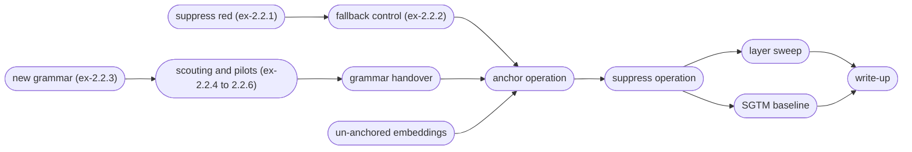

# D2.2 design: anchoring an operation, and the first interventions (DRAFT)

A plan for the second deliverable of M2, laid out several ways: the claims we want to be able to make, the experiments in order, the engineering that has to come first, the risks each experiment retires, and what is out of scope.

Inputs: the D2.1 close-out ([ex-2.1.11](../ex-2.1.11/report.py), [ex-2.1.12](../ex-2.1.12/report.py), and the [post](/references/d2.1-anchored-transformer.md)), the first D2.2 result ([ex-2.2.1](../ex-2.2.1/report.py)), the D2.2-tagged backlog (`./go todo --tag D2.2`), the D2.1 kickoff lessons carried over from the autoencoders, and the [related-work delta](/references/related-work-delta-2026.md).

## What we want to be able to say

1. **Anchoring generalizes past a token attribute.** _Red_ is a property of the token at a known position. An _operation_ is a property of the computation: its evidence is at the op token, and its use is at `=` and after, deeper in the stack. D2.2 is where we find out whether the anchor captures more than the identity of a token at a labelled site.
2. **Suppressing the anchor removes the ability, and the removal is graded and selective.** In M1 this had three parts: a dose-response curve, selectivity (orthogonal colors untouched), and an analytic bound the observed damage approached.
3. **The side-effects were boundable before intervening.** Post-hoc methods now bound side-effects too, estimated from emergent geometry (COAST, arXiv:2605.01167; pre-intervention prediction, arXiv:2606.08365). SCA's distinctive claim is that its bound holds by construction, because the geometry was placed.

**D2.1 never ran an intervention.** The first suppression of a transformer was [ex-2.2.1](../ex-2.2.1/report.py), on the _red_ checkpoints already in the store; the second claim now has its first transformer data, and the third its write-bound half.

## Experiments sketch

Loose plan for experiments to run.

### Prep A: Suppression of concrete concepts (operands)

#### Suppress red on the existing checkpoints

Ran as [ex-2.2.1](../ex-2.2.1/report.py). No training: axis projection applied to the ex-2.1.10 primary (nine seeds), completion accuracy scored on lines with a red operand against lines without, through the eval contract.

What it found: the removal takes effect, it grades with how red the line is, and it stays inside the layer-local write bound at every slice. Zeroing the axis weights does the same job. Selectivity is only partial. The cost to non-red lines comes from the `+` and `=` positions, whose embeddings carry a constant component on the axis. The `operands` and `shaped` arms both avoid that cost, with the shaped suppression removing only about half of *red* at the M1 threshold. On depth, the concept is read from the operand states in the first two blocks, and the last block does not read it; a removal applied only at the embeddings is partly re-derived later. The post-hoc tier (a probe, diff-in-means, and LEACE on the un-anchored control) removes red only at a non-red cost an order of magnitude above the cost of the placed axis.

The bound was stated as layer-local, as the [kickoff lessons](/todo/science/d21-kickoff-carry-over-lessons.md) advise. The geometry bounds the immediate write at the slice we intervene on, including the $1/\sqrt{1-x_1^2}$ gain; what the behavior does in response is a prediction rather than part of the bound. The write bound held. One seed still paid a non-red cost from a write that stayed within bound, so what the later blocks do with a bounded rotation is a property of the trained model, and that is the question for the [layer sweep](#layer-sweep).

These checkpoints have no fallback term, so the response to suppression was undesigned. A red line decodes in the color vocabulary to a near miss of the true answer, a one-step neighbor about half the time, and which neighbor varies by seed. At least five of nine seeds agree on 13% of red lines. That is the reference (baseline) for the [fallback control](#fallback-control).

**The intervention is still open.** Ex-2.2.1 leaves two selective interventions (`operands` and `shaped`) and one that removes fully (the plain projection). None are both complete and selective. Before the [anchor-op prereg](#anchor-one-operation) commits to one, we will run a scoring-only pass on the stored ex-2.2.1 runs: tune the threshold and ramp of the shaped suppression, and try the repulsion form, which sets where the state lands rather than how much is removed ([item](/todo/science/repulsion-sets-the-landing-alignment.md)). There is no training, so it costs what ex-2.2.1 cost to score, and it settles the [shaped-suppression item](/todo/science/shaped-suppression-rather-than-projecting-whole-axis.md). Meanwhile the fallback experiment carries all three as ride-along rows. Done, as [ex-2.2.8](../ex-2.2.8/report.py), on ex-2.2.3's stored checkpoints rather than ex-2.2.1's (the adopted point at twenty seeds and `t00` at five), with every operator also tried at the operand positions. On the adopted point the plain projection is inside the selectivity gate on every op, by less than a band, and the frozen rule proposes it; a threshold above the non-red lines' alignment range removes less at zero cost (`shaped-a0.4-p0` is the syntax-free candidate, recorded for the prereg), and one inside that range costs more than projecting everything. On `t00` only the operand-only edits are feasible. The anchored-op prereg adopts the projection and re-scores it at fresh seeds, keeps `operands` as the selective reference, and names an operand-only operator up front if it runs on a syntax-heavy point.

#### Fallback control

Preregistered as [ex-2.2.2](../ex-2.2.2/report.py). This is [queue item 3](/todo/science/d21-kickoff-carry-over-lessons.md) of the kickoff lessons, and it follows the M1 result [ex-2.9.2](/docs/m1/ex-2.9.2/report.py): teach the model what to produce once the concept has been removed, so the intervention has a designed, predictable outcome. Ex-2.2.1 set the reference at 13% seed agreement on red lines, with a response that is a near miss of the true answer.

It runs on the D2.1 grammar, before the op work. So we test the term on a known recipe with a continuous concept first (*red*), and only later on the categorical null (an operator).

The mechanism is the antipode redirect from m1/ex-2.9.2, in transformer form. At the first anchored slice (the embedding) we reflect every position's state through the axis, flipping α to −α. A stop-gradient holds the reflected states fixed,[^sg] so the term trains the blocks and the unembedding but cannot move the embedding, which is where the concept is placed first. The blocks also write the later anchored slices. The placement there is held by the anchor term on the clean pass rather than by the stop-gradient, and the margin gate of ex-2.2.2 watches it. Each state moves in proportion to how well it aligns with the axis, so the term needs no labels, no target position, and no target role. On red lines we then train the answer at `=` toward the fallback answer.

[^sg]: A stop-gradient is an identity in the forward pass with a gradient of zero: a loss downstream of it cannot move anything upstream of it. Here it sits on the reflected states, so the fallback loss reaches the blocks and the unembedding and leaves the embedding table alone, and with it where the anchor put the concept. The other losses see the clean pass and are unaffected.

The *anti-anchor* term is added to clear out the antipode hemisphere. Its influence does not overlap with the *anchor* term, so it can have a higher weight than the *anti-subspace* term. Arms without each term will say whether either matters in models with this much spare capacity.

**The fallback answer for a continuous concept.** For *red* the null has no mode. The operand-averaged null is the answer with the red operand replaced by any closed partner of the visible operand, and on this grid it is uniform over 27 colors, so a greedy decode or a seed-agreement read has nothing to converge on.

We use the center of the null instead: the visible operand mixed with *mid-gray* and rounded to the grid. That is the per-channel median of the null, and it carries over the *gray* target from M1. A prereg for a continuous concept has to state this choice. The op experiments have a null with a mode, and the later categorical experiments should use it.

There is a known mismatch. We train the response at the antipode, while the ex-2.2.1 projection rewrites the state as zero, which is off-manifold. So fallback accuracy under the projection tells us how far the designed response carries over to a state that training never visited. Nothing is deployed yet, and the reflection may turn out to be the intervention we use. The two differ in that a reflection can be undone. That matters if we want unlearning, and not if we only want a designed response.

Weight ablation has both forms as well: `ablate` in the contract puts the projector into every matrix, and putting the reflector there instead gives the reflection in weight space.

Ex-2.2.2 measures the mismatch as a sweep in intervention strength, from the trained state (reflection, γ = 2) down through zero (γ = 1). The [two-op concept swap](/todo/science/redirect-between-two-anchored-ops.md) (D2.3) removes the mismatch outright, since it redirects to a state that training visits in the ordinary course of the task.

We considered closing the gap here instead, by rehearsing the intervention: apply the projection operator on a fraction of training steps and train the output toward the fallback. We rejected it because:
**1.** A fallback seen under the same operator the model trained on tells us the model converged, not that anything was removed, and
**2.** The training pressure would reward keeping the concept readable off the axis and emitting the fallback only when the projected state is detected (masked, rather than removed).
It is refiled as an auditing question: [rehearsed fallback as an auditing probe](/todo/science/rehearsal-fallback-as-auditing-probe.md).

More of the model follows the edit than in the autoencoders, four blocks and the unembedding rather than one decoder, so the task gate watches what the term costs.

**Relation to the Most Forbidden Technique.** Fallback control trains on the anchor axis, which is also the signal we read. Training against an interpretability signal is what [the Most Forbidden Technique](https://thezvi.substack.com/p/the-most-forbidden-technique) warns about: once the model has been optimized on the signal, the signal stops meaning what it meant. The failure mode here would be a model that detects the edit and emits the fallback while keeping the concept readable elsewhere, so that a mask looks like removal.

Mitigations:
**(a)** The stop-gradient, so the fallback term cannot move the placement at or before the edit.
**(b)** The antipode as the trained state. No clean state sits there, so the readout can key on the axis alone. A fallback trained at the projected state would instead have to tell a projected red line from a non-red one, and only off-axis features could do that.
**(c)** The off-axis audit, which checks whether red stays linearly readable off the axis.
**(d)** No rehearsal, since training under the intervention would reward masking.
The discussion in ex-2.2.2 interprets its results against this paragraph.

**Auditing rows.** The eval-contract dep promised the 2025 auditing rows before any arm was scored, and ex-2.2.1 scored its arms without them, so this prereg decides them row by row. *Off-axis recoverability* runs in ex-2.2.2 as an exploratory row: a ridge probe for redness, fitted per slice on the intervened operand states, in the fallback and no-fallback conditions. A response trained at the antipode is one case where red could stay readable off-axis. *Activation perturbation* (ActPert) and *relearning rebound* wait for D2.3. ActPert goes beside the RMU row; relearning rebound needs a fine-tuning budget, costed then, and will relearn from the `ablate` weights as the permanent removal.

### Prep B: New grammar with more operations

#### The multi-op grammar, with red anchored again

Preregistered as [ex-2.2.3](../ex-2.2.3/report.py). The grammar change forces retraining, so this is the regression check: control, the ex-2.1.10 reference recipe, and the ex-2.1.11 survey's proposals, all on the new grammar.

Which proposals: `t00` and the trials the survey could not tell apart from it (four sit within one band, spanning $λ_a$ 0.28–0.94; `t48` and `t12` among them). Confirming the set corrects for winner's-curse. This is how the survey's handoff ("D2.2 confirms at fresh seeds before any of these numbers is quoted") is honoured on the grammar we will use.

The [redder-than-both](/todo/science/operation-can-make-answer-redder-than-both.md) item lands here too, since every op but `lighten` allows that.

Optional arm: control models at one, three, and six operations, with the cube probed as in ex-2.1.12, to ask whether a richer op set gives the model a better operand geometry (see the [backlog item](/todo/science/richer-op-set-operand-geometry.md)). It is an arm on un-anchored models only, so it cannot confound the anchored conditions. Task-diversity phase transitions in in-context learning (memorization below a diversity threshold, generalization above; arXiv:2306.15063, arXiv:2405.11751) motivate a companion question on the same sweep: run on the ex-2.1.5 two-form corpus, does added op diversity move hex and named colors toward the shared representation D2.1 never found ([backlog item](/todo/science/does-op-diversity-buy-cross-form-sharing.md))?

#### Scouting, pilots, and the grammar handover

Ex-2.2.3 left the grammar with a problem for the removal reads: on four of the six ops, most red lines have an answer that a model without *red* can still give, because the op saturates or copies the other operand's channel. Rather than preregister the anchored-op experiments on that footing, a [scouting round](../ex-2.2.4/report.py) read candidate ops on the grid, and two pilots retrained the adopted point under a [stochastically rounded corpus](../ex-2.2.5/report.py) and a [whole-line labeller](../ex-2.2.6/report.py). None of these is scored; each proposes.

The proposals, from ex-2.2.4: table A+ (drop `add`; add `difference`, `exclusion`, and `hsvmix`; carry `hue-hsv`, `sat-hsv`, and `value-hsv` as a marked subset, the first ops that read operand order); a removal statistic that is a distance from the correct answer, scored on lines where zeroing the red operand's R moves the answer far, with exact match beside it; and, for comparability with M3, stochastic rounding and the whole-line labeller, which the pilots found cost nothing on the anchoring side. Under stochastic rounding an answer is a distribution, so dependence, removal, and calibration are all read as how much answer mass moves, and *op-relevance* becomes the expected agreement between ops rather than a count.

The **handover** is the preregistered experiment that adopts these: ex-2.2.3's recipe on table A+ with the new corpus and labeller, against ex-2.2.3's twenty seeds, with `mix` kept as the reference op and `hsvmix` beside it, and one arm each with only the corpus or only the labeller changed. Until it runs, the grammar of record is ex-2.2.3's; thereafter, plain `mix` will likely be dropped. Open questions it has to settle: whether to hold lines per op fixed at eleven ops (E4 of ex-2.2.3 found the operand cube less decodable at six ops than at three, with lines per op as a confound), and a probe draw that walks every color as op2 for the non-commutative subset.

### Prep C: Embeddings

#### Un-anchored embeddings

Anchor all slices except the embeddings. We don't expect concepts to map to tokens in more complex models and languages anyway.

Hypotheses:
**(a)** the hidden-state slices align as they did in earlier experiments, which would let later experiments leave the embeddings out;
**(b)** the color embeddings become somewhat aligned anyway, because their directions correlate with the anchored hidden states;
**(c)** the constant component that ex-2.2.1 found on the syntax embeddings is gone, and with it the non-red cost of the plain projection.

Hypothesis (c) is scored because every training experiment from here scores its checkpoints through the eval contract. Hypotheses (b) and (c) split the embedding table by token class, so they conflict only if the correlation in (b) reaches the syntax tokens, whose hidden states are not pulled. If it does reach them, that may resolve once there are several operations and the op token does work of its own.

This is different from the [layer sweep](#layer-sweep), which tests the model's ability to route around intervention.

### Anchor one operation

One operation on e₁, the others unlabelled, D2.1's recipe + the lessons from above, all slices pulled — though perhaps not the embeddings, depending on how [un-anchored embeddings](#un-anchored-embeddings) lands: an anchor on the op token's embedding is token identity by construction, the very collapse the risk table warns about. The layer sweep comes after, on a frozen recipe, so layer effects are not confounded with schedule fragility (the D2.1 kickoff rule). The labeller keys on the op token, with the position-free mechanism from ex-2.1.10.

Measurements: alignment at the op position by slice; group contrast (anchored op against the others, which is the categorical form of grading); task gates against control; and a probe scan of op-identity decodability at every site, against the control.

What we hope to see from the scan is approx. _no change_ against control — an equivalence claim, so the prereg must declare the margin it has to land within. We are anchoring the hidden state, not relocating the computation, and the scan is the side-effects read (ex-2.1.12's H2, for the op). The equivalence read may need many seeds (20?), so a small smoke test runs first: a few seeds against the alignment and task gates alone, to establish that anchoring an op works at all before the seed budget is spent on the margin.

Nice to have: Sweep over all ops to see whether they can all be anchored equally well.

### Suppress the operation (and the operands)

The centre of D2.2.

The headline claim is selective removal: suppress *add* without suppressing *multiply*. The ops may share a common component that means *this is an operation*, with the specific op only one part of the state; the group contrast from [anchor operation](#anchor-one-operation) says how large that shared part is, and the removal claim covers the op-specific part.

The dose axis is intervention strength, because the stimulus side of a categorical concept grades too coarsely: *op-relevance* (below) occupies only three or four levels on a six-op table, and a few more on the eleven-op table A+. Scale the suppression rather than always projecting fully — keep a fraction $1-γ$ of the component, $γ: 0 → 1$; the [shaped-suppression item](/todo/science/shaped-suppression-rather-than-projecting-whole-axis.md) and M1's shaped suppression are the machinery. Prediction: anchored-op damage rises monotonically with $γ$, other ops within gate along the whole curve.

The per-line prediction at full suppression comes from the designed null. The *null* is *op-averaged* — the least committal prediction available from the operands with no op, given by the distribution over the answers to all ops.[^m] Against the *op-averaged* null, *op-relevance* for a line is the weight the mixture withholds from the anchored op's answer: zero where every op in the table agrees on that pair, $\frac{n-1}{ n}$ where the anchored op is alone in its answer. Predictions: per-line damage follows *op-relevance* and stays within the bound the mixture sets.

[^m]: We considered calling this *op-marginal*, but we also have a *margin* measurement $m$, which would be confusing.

Read the response off the probability mass on the correct answer, or off the decoded answer's distance from it. Hard accuracy steps rather than grades under an averaged null, since greedy decoding keeps the plurality answer, so accuracy is the gate statistic and not the response statistic.

Conditions test the contrast from m1/ex-2.9.2: control, no-fallback, fallback — plus a filtered-corpus row, a control trained with the anchored op's lines held out. The fallback trains toward the *op-averaged* distribution — the designed null itself, as soft labels — so fallback and no-fallback share the per-line prediction, and the fallback condition's claim is tighter adherence to it: less seed scatter, more mass on the mixture. That is the removal reference the [baselines item](/todo/science/baseline-comparisons-sca-plan-related-work-delta.md) wanted placed, and the eval contract scores it like any other triple.

The same models have an operand anchor too (or a companion condition does), so operand suppression runs beside operation suppression with the machinery from [suppress red](#suppress-red-on-the-existing-checkpoints).

The **bypass test** the D1.3 post left open: suppress at the op-token position only, at all positions, at one slice, at all slices. Where suppression fails to bite, the model is reading the op from somewhere the axis does not reach. That is a finding about anchoring, and it feeds the [layer sweep](#layer-sweep).

Nice to have: Sweep over all ops to see whether they can all be suppressed equally well.

### Layer sweep

Anchor at subsets of slices (single ℓ, prefix ≤ ℓ, suffix ≥ ℓ, all) on a frozen schedule, then run the [suppress operation](#suppress-the-operation-and-the-operands) intervention at the anchored slices. This tests the claim that bounds are layer-local. The geometric bound covers the immediate write, and we need to know whether later blocks amplify or absorb the edit.

Ex-2.2.1 already says what to expect for *red*. The concept is read in the first two blocks, and the last block does not read it. So a removal acting at the embedding and the first block should match the full intervention, and one that starts later should not. That is a prediction about prefixes and suffixes, so we favor a prefix/suffix bracket over single slices.

Caveat on reading depth this way: at d64-L4 on one operation the model has capacity to spare, so where it reads the concept may say more about what it can afford than about what the task needs. Several operations may draw on more of the depth, and the character-level runs (ex-2.1.5, ex-2.1.6) already used more layers than the word-level ones. Still to decide: whether this is one experiment or two, since anchor layer × intervention layer is a grid.

### SGTM baseline

Its own preregistered experiment (arXiv:2512.05648), method-agnostic through the eval contract, reusing our labels. RMU and SAE rows wait for D2.3, as the [baselines item](/todo/science/baseline-comparisons-sca-plan-related-work-delta.md) sequences them.

### Write-up

The D2.2 post.

## Deps

- **The operation as a variable.** As specified in the [backlog item](/todo/science/make-operation-variable-before-d2-2-sca.md): an op table (name, surface form, grid function with defined rounding, closed on 0..15), `op` on `Example`, seen-pair bookkeeping keyed on `(op, pair)`, ops spelled as words, and the infix frame kept for the probes. The first table is `mix` (the D2.1 op), saturating `add`, `screen`, `multiply`, `lighten` (per-channel max), and `darken` (per-channel min), specified in [ex-2.2.3](../ex-2.2.3/experiment.py): each rule is computed on the 0..15 scale and snapped to the nearest level of the six-level grid, so every op answers every pair with a vocabulary color. An earlier draft of that prereg kept D2.1's closed-pair rule instead, under which `screen` and `multiply` are degenerate; the rounding rule makes all six total and distinct (no two agree on more than about 38% of pairs). Every new op departs from `mix` on more than 90% of pairs, so the model has to read the op; `add`–`screen`, `screen`–`lighten`, and `multiply`–`darken` each agree on about a third of pairs and populate the middle *op-relevance* levels. The relevance distribution for each candidate anchored op, under the table's own rounding, is rendered in ex-2.2.3's method, since the per-line predictions in [suppress operation](#suppress-the-operation-and-the-operands) rest on it. `divide` needs a saturation rule and is lumpy on a 16-level grid, so it stays out of the first table. Ops that convert through other color spaces (`hue`, `saturation`, `brightness`) were filed at [richer op set](/todo/science/richer-op-set-operand-geometry.md) and have since been read on the grid by [ex-2.2.4](../ex-2.2.4/report.py), which proposes the second table, A+, described under [scouting](#scouting-pilots-and-the-grammar-handover). With ops that read operand order in the table, relevance is counted over ordered pairs.
- **The eval contract and operator library.** Landed with [ex-2.2.1](../ex-2.2.1/report.py) as [`sca.intervention`](/src/sca/intervention.py): the triple, the three operators, and the post-hoc fitters. Every method produces a triple of `(model, subspace, intervention operator)`, and one scorer takes that triple. The operators are axis projection with a strength γ (γ = 2 is reflection), the shaped suppression from M1, and weight ablation. Every training experiment from [fallback control](#fallback-control) on scores its checkpoints through the contract, so adding an operator or a row is a change to one module.

  The contract also pins where operators act and what they do to the norm. The hook point is the between-block stream, meaning the slices that `residual_stream()` returns, which are the same states the anchor term reads. The stream is unit-norm (nGPT), so axis projection composes with a re-projection back onto the sphere. The state lands on the great subsphere where zero-concept states live, and the surviving components pick up a per-position gain of $1/\sqrt{1-x_1^2}$. That gain is computable beforehand, so it belongs inside the bound. Weight ablation declares its order against the `normalize_weights` constraint, which rescales a matrix once entries are zeroed.

  The 2025 auditing rows are relearning rebound (arXiv:2505.22310), activation perturbation (ActPert, arXiv:2505.23270), and off-axis recoverability (arXiv:2605.11685). They were to be declared before any arm was scored. Ex-2.2.1 scored its arms without them, and the decision is now recorded under [fallback control](#fallback-control): off-axis recoverability runs there, and the other two wait for D2.3, which speaks their language in full.
- **Fold the [survey lessons](/todo/science/survey-format-lessons-from-ex-2-1.md) into the plan template**: constraint margins ranked beside the objective, multi-seed promotion near a gate, and the publisher carrying every statistic the analysis promises.

## Decisions

Only what the plan above already commits to; everything else stays open until an experiment forces it.

- [Suppress red](#suppress-red-on-the-existing-checkpoints) ran before the op grammar was ready: no training, and the highest information per dollar in the plan. Done.
- The intervention for the op experiments is chosen by a scoring-only tuning pass on stored runs, before the [anchor-op](#anchor-one-operation) prereg; until then the fallback experiment carries all three as ride-along rows. Done, as [ex-2.2.8](../ex-2.2.8/report.py) on ex-2.2.3's checkpoints: the plain projection on the adopted point, with `operands` beside it and `shaped-a0.4-p0` recorded as the syntax-free candidate.
- The bound claim is layer-local from the start. The geometry bounds the write; what the behavior does in response is a prediction, so a behavioral miss feeds the [layer sweep](#layer-sweep) rather than falsifying the bound.
- [Anchor operation](#anchor-one-operation) opens with a small smoke test, before the many-seed equivalence read.
- The survey is confirmed on the new grammar as a set of proposals, and not replicated literally first.
- The dose axis for the categorical concept is intervention strength; the stimulus side (*op-relevance*) supplies the per-line predictions and the bound.
- The fallback mechanism is the antipode redirect at the first anchored slice, which is the embedding while the embeddings are anchored, with a stop-gradient at the reflected state. Rehearsing the intervention during training is refiled as an [auditing question](/todo/science/rehearsal-fallback-as-auditing-probe.md).
- The fallback answer for a continuous concept is the center of the operand-averaged null; for *red* that is the visible operand mixed with mid-gray. A categorical concept takes the mode of its null instead. Either is a design choice, since the answer can be any function of the line: to have *red* read as *black* under intervention, we would use the same term with black mixed with the visible operand as its answer.
- Auditing rows: off-axis recoverability in [ex-2.2.2](../ex-2.2.2/report.py) as an exploratory row; ActPert and relearning rebound at D2.3.
- Which op to anchor is open until the op table lands and its relevance distributions are computed.
- The second table (A+), stochastic rounding, and the whole-line labeller are proposals from the [scouting round](#scouting-pilots-and-the-grammar-handover), adopted only by the handover prereg; the removal statistic there is a distance rather than exact match.
- The layer sweep takes the shape of a prefix/suffix bracket, following the depth read from ex-2.2.1. The grid question is deferred to the [experiment](#layer-sweep) itself.

## Risks and mitigations

| Risk | Would look like | Retired at |
| --- | --- | --- |
| Suppression does not bite even on _red_ | Accuracy unchanged after projecting e₁ out; color is read from elsewhere | Retired: [ex-2.2.1](../ex-2.2.1/report.py) (red accuracy 0.09) |
| The bound is loose or wrong in a transformer | The non-red write exceeds its geometric bound, or the damage outruns the write-size prediction | Write half retired at [ex-2.2.1](../ex-2.2.1/report.py); the behavioral half belongs to the [layer sweep](#layer-sweep) |
| The response to suppression is undesigned | Suppressed lines scatter by seed; completions leave the color vocabulary | Measured at [ex-2.2.1](../ex-2.2.1/report.py) (13% seed agreement, completions stay in vocabulary); [fallback control](#fallback-control) pins it |
| Recipe is grammar-specific | The proposals from the survey do not reproduce on the new grammar | Retired at [ex-2.2.3](../ex-2.2.3/report.py): the recipe and every proposal reproduce (H2, H3), at a plateau 0.05 lower than the survey's; the frozen rule adopted `t00`, and a post hoc read with the lead and selectivity gates narrows the choice to the recipe, whose short arm D2.2 builds on (`recipe-short`, by decision after the twenty-seed E6 read) |
| Task cost grows with an abstract concept anchor | Gate misses in [anchor operation](#anchor-one-operation) that [new grammar](#the-multi-op-grammar-with-red-anchored-again) did not have | [anchor operation](#anchor-one-operation) |
| Anchoring an op captures the token, not the operation | Alignment lands, and suppression is inert | [suppress operation](#suppress-the-operation-and-the-operands) |
| Bypass through attention or the residual | Suppression works only when applied at every site | [suppress operation](#suppress-the-operation-and-the-operands), [layer sweep](#layer-sweep) |

The first experiments all change one thing from D2.1, so a negative there should be interpretable.

## Out of scope

Verification lines (D2.3). Several ops on separate axes (a D2.3 candidate, for the subspace bound and the [two-op concept swap](/todo/science/redirect-between-two-anchored-ops.md)). The feedback controller (the kickoff advice stands). RMU and SAE baselines, and a full LUNAR row beside them; a LUNAR-style redirect, the nearest analogue of the fallback, runs as an exploratory row of ex-2.2.2. Resolving D2.1's H2 decodability question ([its own item](/todo/science/global-structure-preserved-under-anchoring.md)), run when the claim is needed. Stream-vs-init attribution ([kickoff](/todo/science/d21-kickoff-carry-over-lessons.md) queue item 4), until there is an anchoring failure worth attributing — D2.1 produced none.
