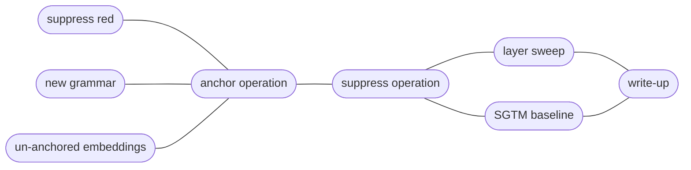

# D2.2 design: anchoring an operation, and the first interventions

A plan for the second deliverable of M2, laid out several ways: the claims we want to be able to make, the experiments in order, the engineering that has to come first, the risks each experiment retires, and what is out of scope.

Inputs: the D2.1 close-out ([ex-2.1.11](../ex-2.1.11/report.py), [ex-2.1.12](../ex-2.1.12/report.py), and the [post](/references/d2.1-anchored-transformer.md)), the D2.2-tagged backlog (`./go todo --tag D2.2`), the D2.1 kickoff lessons carried over from the autoencoders, and the [related-work delta](/references/related-work-delta-2026.md).

## What we want to be able to say

1. **Anchoring generalizes past a token attribute.** _Red_ is a property of the token at a known position. An _operation_ is a property of the computation: its evidence is at the op token, and its use is at `=` and after, deeper in the stack. D2.2 is where we find out whether the anchor captures more than the identity of a token at a labelled site.
2. **Suppressing the anchor removes the ability, and the removal is graded and selective.** In M1 this had three parts: a dose-response curve, selectivity (orthogonal colors untouched), and an analytic bound the observed damage approached.
3. **The side-effects were boundable before intervening.** Post-hoc methods now bound side-effects too, estimated from emergent geometry (COAST, arXiv:2605.01167; pre-intervention prediction, arXiv:2606.08365). SCA's distinctive claim is that its bound holds by construction, because the geometry was placed.

**D2.1 never ran an intervention.** The first suppression of a transformer happens in D2.2, and the cheapest way to run it is on the _red_ checkpoints already in the store.

## Experiments sketch

Loose plan for experiments to run.

### Suppress _red_ on the existing checkpoints

No training. Apply the intervention to the ex-2.1.10 primary (nine seeds) and score completion accuracy on lines with red operands against lines without.

Hypotheses, in outline: red-line accuracy drops; non-red lines stay within the task gate; the drop is graded with the operand's redness (similar to the M1 dose-response); and a side-effect prediction computed from the geometry beforehand bounds the observed non-red change.

These checkpoints have no fallback term, so the response to suppression is whatever the untrained region decodes — M1 called that spoofing, and it is where ex-2.9.1's seed spread came from. This experiment measures the undesigned fallback, and sets the reference the fallback condition in [suppress operation](#suppress-the-operation-and-the-operands) has to beat.

Post-hoc baseline tier: a probe direction, diff-in-means, and LEACE fitted on the un-anchored control, pushed through the same scorer. Calibration for following experiments.

### The multi-op grammar, with _red_ anchored again

The grammar change forces retraining, so this is the regression check: control, the ex-2.1.10 reference recipe, and the ex-2.1.11 survey's proposals, all on the new grammar.

Which proposals: `t00` and the trials the survey could not tell apart from it (four sit within one band, spanning λ_a 0.28–0.94; `t48` and `t12` among them). Confirming the set corrects for winner's-curse. This is how the survey's handoff ("D2.2 confirms at fresh seeds before any of these numbers is quoted") is honoured on the grammar we will use.

The [redder-than-both](/todo/science/operation-can-make-answer-redder-than-both.md) item lands here too, since saturating add and screen allow that.

Optional arm: control models at one, three, and six operations, with the cube probed as in ex-2.1.12, to ask whether a richer op set gives the model a better operand geometry (see the [backlog item](/todo/science/richer-op-set-operand-geometry.md)). It is an arm on un-anchored models only, so it cannot confound the anchored conditions.

### Un-anchored embeddings

Anchor all slices except the embeddings. We don't expect concepts to map to tokens in more complex models anyway.

Hypotheses, in outline: the embeddings will become somewhat-aligned anyway, because their directions should correlate with the hidden states.

This is different from the [layer sweep](#layer-sweep), which tests the model's ability to route around intervention.

### Anchor one operation

One op on e₀, the others unlabelled, D2.1's recipe, all slices pulled. Perhaps not the embeddings, depending on [un-anchored embeddings](#un-anchored-embeddings), if it was run first. The layer sweep comes after, on a frozen recipe, so layer effects are not confounded with schedule fragility (the D2.1 kickoff rule). The labeller keys on the op token, with the position-free mechanism from ex-2.1.10.

Measurements: alignment at the op position by slice; group contrast (anchored op against the others, which is the categorical form of grading); task gates against control; and a probe scan of op-identity decodability at every site, against the control.

What we hope to see from the scan is approx. _no change_ against control. We are anchoring the hidden state, not relocating the computation, and the scan is the side-effects read (ex-2.1.12's H2, for the op).

Extension: sweep over all ops to see whether they can all be anchored equally well.

### Suppress the operation (and the operands)

The centre of D2.2. A graded dose-response needs a graded label for a categorical concept, and the label follows from what the model produces once the op signal is gone — which we design rather than predict (the fallback dep below). Against the **op-mixture** null, **op-relevance** for a line is the weight the mixture withholds from the anchored op's answer: zero where every op in the table agrees on that pair, ¾ where the anchored op is alone in its answer. Predictions: damage on anchored-op lines rises with op-relevance and stays within the bound the mixture sets; other ops stay within gate.

Read the dose off the probability mass on the correct answer, or off the decoded answer's distance from it. Hard accuracy steps rather than grades under a mixture null, since greedy decoding keeps the plurality answer, so accuracy stays the gate statistic and not the dose statistic.

Conditions carry ex-2.9.2's contrast: `base` (no fallback term) against `fallback`, one label, one scorer. In the base arm op-relevance is a prediction about an untrained region, and the M1 prior is that it scatters by seed.

The same models have an operand anchor too (or a companion condition does), so operand suppression runs beside operation suppression with the machinery from [suppress red](#suppress-_red_-on-the-existing-checkpoints). One model, two kinds of concept, one scorer.

The **bypass test** the D1.3 post left open: suppress at the op-token position only, at all positions, at one slice, at all slices. Where suppression fails to bite, the model is reading the op from somewhere the axis does not reach. That is a finding about anchoring, and it feeds the [layer sweep](#layer-sweep).

Extension: sweep over all ops to see whether they can all be suppressed equally well.

### Layer sweep

Anchor at subsets of slices (single ℓ, prefix ≤ ℓ, suffix ≥ ℓ, all) on a frozen schedule, then run the [suppress operation](#suppress-the-operation-and-the-operands) intervention at the anchored slice. This is where "bounds become layer-local" is tested: the geometric bound covers the immediate write, and whether later blocks amplify or absorb the edit is what the sweep measures. Whether this is one experiment or two (anchor layer × intervention layer is a grid) is decided when we get here; the prior is to bracket rather than survey.

### SGTM baseline

Its own preregistered experiment (arXiv:2512.05648), method-agnostic through the eval contract, reusing our labels. RMU and SAE rows wait for D2.3, as the [baselines item](/todo/science/baseline-comparisons-sca-plan-related-work-delta.md) sequences them.

### Write-up

The D2.2 post, and the survey-confirmation numbers beside the survey's own.

## Deps

- **The operation as a variable.** As specified in the [backlog item](/todo/science/make-operation-variable-before-d2-2-sca.md): an op table (name, surface form, grid function with defined rounding, closed on 0..15), `op` on `Example`, seen-pair bookkeeping keyed on `(op, pair)`, ops spelled as words, the infix frame kept for the probes. First table: `mix` (the default), saturating `add`, `screen`, `multiply`. Between them, one op departs from `mix` on most pairs (the model must read the op) and others only sometimes do (so op-relevance is graded rather than binary). `divide` needs a saturation rule and is lumpy on a 16-level grid, so it stays out of the first table; ops in other color spaces (`hue`, `saturation`, `brightness`) are a separate question, filed.
- **Fallback control for the transformer.** [Queue item 3](/todo/science/d21-kickoff-carry-over-lessons.md) of the kickoff lessons, and M1's [ex-2.9.2](/docs/m1/ex-2.9.2/report.py) result: teach the model what to produce once the concept has been removed, so the intervention has a designed outcome rather than a measured one. The *null* is the **op-mixture** — for a pair, the distribution over the answers the table's ops give it — the least committal prediction available from the operands with no op. M1's mid-gray is its degenerate case, where removal left nothing to condition on. Two ways to pin it, chosen at build time:
  (a) redirect to the anti-anchor direction as M1 did, which needs the anti-anchor term that `sca/anchoring.py` does not carry (ex-2.1.6 left it out), or
  (b) teach the response to the projection operator on a fraction of steps, reserving no direction but costing a second forward pass, and matching the axis-projection operator in the eval contract.
  Either way the term stops being decoder-only — downstream of an anchored slice is every remaining block — so the task gate has to watch what it costs.
- **The eval contract and operator library.** Every method produces `(model, subspace, intervention operator)`; one scorer takes the triple. Operators: axis projection, the M1 lobe, weight ablation. This is far cheaper to fix now than after [anchor operation](#anchor-one-operation) has code.
- **Fold the [survey lessons](/todo/science/survey-format-lessons-from-ex-2-1.md) into the plan template**: constraint margins ranked beside the objective, multi-seed promotion near a gate, and the publisher carrying every statistic the analysis promises.

## Risks, and which experiment retires each

| Risk | Would look like | Retired at |
| --- | --- | --- |
| Suppression does not bite even on _red_ | Accuracy unchanged after projecting e₀ out; color is read from elsewhere | [suppress red](#suppress-_red_-on-the-existing-checkpoints) |
| The bound is loose or wrong in a transformer | Observed non-red damage exceeds the geometric prediction | [suppress red](#suppress-_red_-on-the-existing-checkpoints), then [layer sweep](#layer-sweep) |
| The response to suppression is undesigned | Suppressed lines scatter by seed; completions leave the color vocabulary | [suppress red](#suppress-_red_-on-the-existing-checkpoints) measures it, [suppress operation](#suppress-the-operation-and-the-operands) pins it |
| Recipe is grammar-specific | The survey's proposals do not reproduce on the new grammar | [new grammar](#the-multi-op-grammar-with-_red_-anchored-again) |
| Task cost grows with an abstract concept | Gate misses in [anchor operation](#anchor-one-operation) that [new grammar](#the-multi-op-grammar-with-_red_-anchored-again) did not have | [anchor operation](#anchor-one-operation) |
| Anchoring an op captures the token, not the operation | Alignment lands, and suppression is inert | [suppress operation](#suppress-the-operation-and-the-operands) |
| Bypass through attention or the residual | Suppression works only when applied at every site | [suppress operation](#suppress-the-operation-and-the-operands), [layer sweep](#layer-sweep) |

Both [suppress red](#suppress-_red_-on-the-existing-checkpoints) and [new grammar](#the-multi-op-grammar-with-_red_-anchored-again) change one thing from D2.1, so a negative there stays interpretable.

## Out of scope

Verification lines (D2.3). Several ops on separate axes (a D2.3 candidate, for the subspace bound). The feedback controller (the kickoff advice stands). RMU and SAE baselines. The word-level tokenizer, unless [anchor operation](#anchor-one-operation) fails. HSV-valued colors as tokens. Resolving D2.1's H2 decodability question ([its own item](/todo/science/global-structure-preserved-under-anchoring.md)), run when the claim is needed.

## Decisions taken

- Anchor `screen` first; `mix` stays the default and `add` is the second contrast.
- Run [suppress red](#suppress-_red_-on-the-existing-checkpoints) before the op grammar is ready: it needs no grammar change and has the highest information per dollar in the plan.
- The survey is confirmed on the new grammar, as a set of proposals, and not replicated literally first.
- Layer sweep shape: deferred to the [experiment](#layer-sweep) itself.
- `mix` is the default op *in the table*, which says what the grammar was built around and not what a suppressed model outputs.
- Op-relevance is measured against a designed null, the op-mixture, so the dose label and the bound come from the same construction. Consumes queue item 3 of the kickoff lessons.
