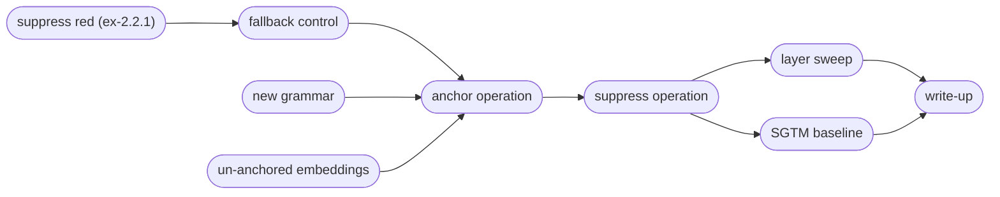

# D2.2 design: anchoring an operation, and the first interventions (DRAFT)

A plan for the second deliverable of M2, laid out several ways: the claims we want to be able to make, the experiments in order, the engineering that has to come first, the risks each experiment retires, and what is out of scope.

Inputs: the D2.1 close-out ([ex-2.1.11](../ex-2.1.11/report.py), [ex-2.1.12](../ex-2.1.12/report.py), and the [post](/references/d2.1-anchored-transformer.md)), the D2.2-tagged backlog (`./go todo --tag D2.2`), the D2.1 kickoff lessons carried over from the autoencoders, and the [related-work delta](/references/related-work-delta-2026.md).

## What we want to be able to say

1. **Anchoring generalizes past a token attribute.** _Red_ is a property of the token at a known position. An _operation_ is a property of the computation: its evidence is at the op token, and its use is at `=` and after, deeper in the stack. D2.2 is where we find out whether the anchor captures more than the identity of a token at a labelled site.
2. **Suppressing the anchor removes the ability, and the removal is graded and selective.** In M1 this had three parts: a dose-response curve, selectivity (orthogonal colors untouched), and an analytic bound the observed damage approached.
3. **The side-effects were boundable before intervening.** Post-hoc methods now bound side-effects too, estimated from emergent geometry (COAST, arXiv:2605.01167; pre-intervention prediction, arXiv:2606.08365). SCA's distinctive claim is that its bound holds by construction, because the geometry was placed.

**D2.1 never ran an intervention.** The first suppression of a transformer happens in D2.2, and the cheapest way to run it is on the _red_ checkpoints already in the store.

## Experiments sketch

Loose plan for experiments to run.

### Suppress red on the existing checkpoints

No training. Apply the intervention to the ex-2.1.10 primary (nine seeds) and score completion accuracy on lines with red operands against lines without.

Hypotheses, in outline: red-line accuracy drops; non-red lines stay within the task gate; and the drop is graded with the operand's redness (similar to the M1 dose-response).

The bound hypothesis has two parts, because M1's bound had the decoder one linear readout from the intervention, and here every later block sits between the write and the output. The strict part is layer-local, as the [kickoff lessons](/todo/science/d21-kickoff-carry-over-lessons.md) advise: the geometry bounds the immediate write — the activation change at the intervened slice on non-red lines, the $1/\sqrt{1-x_1^2}$ gain included — and it holds by construction. The behavioral part is a prediction rather than a bound: non-red damage stays within what the write size implies, under a relation the prereg has to state. A behavioral miss with the write bound intact means later blocks amplify the edit, which is the [layer sweep](#layer-sweep)'s question arriving early, and a finding rather than a method failure.

These checkpoints have no fallback term, so the response to suppression is whatever the untrained region decodes — M1 called that spoofing, and it is where ex-2.9.1's seed spread came from. This experiment measures the undesigned fallback, and sets the reference the fallback condition has to beat.

Post-hoc baseline tier: a probe direction, diff-in-means, and LEACE fitted on the un-anchored control, pushed through the same scorer. Calibration for following experiments.

### Fallback control

[Queue item 3](/todo/science/d21-kickoff-carry-over-lessons.md) of the kickoff lessons, and the M1 follow-up [ex-2.9.2](/docs/m1/ex-2.9.2/report.py) result: teach the model what to produce once the concept has been removed, so the intervention has a designed, predictable outcome.

Runs on the D2.1 grammar, before the op work: the term gets proven on the known recipe and a continuous concept before it meets the categorical null. The mechanism is the antipode redirect from ex-2.9.2. This may need the *anti-anchor* term, which we haven't used yet in transformers. It's similar to the *anti-subspace* term, but directional, which means it needn't oppose the *anchor* term and can have a higher weight. OTOH we may not notice the difference in these models, since they have plenty of capacity to spare.

The known limitation: the response is trained at the antipode while the eval projects to zero, so the score reads how far the designed response carries to a state training never visited. The [two-op concept swap](/todo/science/redirect-between-two-anchored-ops.md) (D2.3) resolves that mismatch — its redirect target is a state training visits in the ordinary course of the task. We considered closing it here instead by rehearsing the intervention (apply the projection operator on a fraction of training steps and train the output toward the fallback) and rejected that: a fallback observed under the operator the model was trained on is a convergence result rather than a removal result, and the training pressure rewards keeping the concept readable off-axis with the fallback emitted only where the projected state is detected — the masked-vs-removed failure itself. Refiled as an auditing question: [rehearsed fallback as an auditing probe](/todo/science/rehearsal-fallback-as-auditing-probe.md).

Unlike in autoencoders, the effect stops being decoder-only, because the intervention is followed by more layers — so the task gate has to watch what it costs.

### The multi-op grammar, with red anchored again

The grammar change forces retraining, so this is the regression check: control, the ex-2.1.10 reference recipe, and the ex-2.1.11 survey's proposals, all on the new grammar.

Which proposals: `t00` and the trials the survey could not tell apart from it (four sit within one band, spanning $λ_a$ 0.28–0.94; `t48` and `t12` among them). Confirming the set corrects for winner's-curse. This is how the survey's handoff ("D2.2 confirms at fresh seeds before any of these numbers is quoted") is honoured on the grammar we will use.

The [redder-than-both](/todo/science/operation-can-make-answer-redder-than-both.md) item lands here too, since saturating add and screen allow that.

Optional arm: control models at one, three, and six operations, with the cube probed as in ex-2.1.12, to ask whether a richer op set gives the model a better operand geometry (see the [backlog item](/todo/science/richer-op-set-operand-geometry.md)). It is an arm on un-anchored models only, so it cannot confound the anchored conditions. Task-diversity phase transitions in in-context learning (memorization below a diversity threshold, generalization above; arXiv:2306.15063, arXiv:2405.11751) motivate a companion question on the same sweep: run on the ex-2.1.5 two-form corpus, does added op diversity move hex and named colors toward the shared representation D2.1 never found ([backlog item](/todo/science/does-op-diversity-buy-cross-form-sharing.md))?

### Un-anchored embeddings

Anchor all slices except the embeddings. We don't expect concepts to map to tokens in more complex models and languages anyway.

Hypotheses, in outline: The other states will be aligned as in earlier experiments; this would suggest that we can exclude embeddings from anchoring in subsequent experiments. And the embeddings will become somewhat-aligned anyway, because their directions should correlate with the hidden states.

This is different from the [layer sweep](#layer-sweep), which tests the model's ability to route around intervention.

### Anchor one operation

One operation on e₁, the others unlabelled, D2.1's recipe + the lessons from above, all slices pulled — though perhaps not the embeddings, depending on how [un-anchored embeddings](#un-anchored-embeddings) lands: an anchor on the op token's embedding is token identity by construction, the very collapse the risk table warns about. The layer sweep comes after, on a frozen recipe, so layer effects are not confounded with schedule fragility (the D2.1 kickoff rule). The labeller keys on the op token, with the position-free mechanism from ex-2.1.10.

Measurements: alignment at the op position by slice; group contrast (anchored op against the others, which is the categorical form of grading); task gates against control; and a probe scan of op-identity decodability at every site, against the control.

What we hope to see from the scan is approx. _no change_ against control — an equivalence claim, so the prereg must declare the margin it has to land within. We are anchoring the hidden state, not relocating the computation, and the scan is the side-effects read (ex-2.1.12's H2, for the op). The equivalence read may need many seeds (20?), so a small smoke test runs first: a few seeds against the alignment and task gates alone, to establish that anchoring an op works at all before the seed budget is spent on the margin.

Nice to have: Sweep over all ops to see whether they can all be anchored equally well.

### Suppress the operation (and the operands)

The centre of D2.2.

The headline claim is selective removal: suppress *add* without suppressing *multiply*. The ops may share a common component that means *this is an operation*, with the specific op only one part of the state; the group contrast from [anchor operation](#anchor-one-operation) says how large that shared part is, and the removal claim covers the op-specific part.

The dose axis is intervention strength, because the stimulus side of a categorical concept grades too coarsely: *op-relevance* (below) occupies only two or three levels on a four-op table. Scale the suppression rather than always projecting fully — keep a fraction $1-γ$ of the component, $γ: 0 → 1$; the [shaped-suppression item](/todo/science/shaped-suppression-rather-than-projecting-whole-axis.md) and M1's shaped suppression are the machinery. Prediction: anchored-op damage rises monotonically with $γ$, other ops within gate along the whole curve.

The per-line prediction at full suppression comes from the designed null. The *null* is *op-averaged* — the least committal prediction available from the operands with no op, given by the distribution over the answers to all ops.[^m] Against the *op-averaged* null, *op-relevance* for a line is the weight the mixture withholds from the anchored op's answer: zero where every op in the table agrees on that pair, $\frac{n-1}{ n}$ where the anchored op is alone in its answer. Predictions: per-line damage follows *op-relevance* and stays within the bound the mixture sets.

[^m]: We considered calling this *op-marginal*, but we also have a *margin* measurement $m$, which would be confusing.

Read the response off the probability mass on the correct answer, or off the decoded answer's distance from it. Hard accuracy steps rather than grades under an averaged null, since greedy decoding keeps the plurality answer, so accuracy is the gate statistic and not the response statistic.

Conditions test the contrast from m1/ex-2.9.2: control, no-fallback, fallback — plus a filtered-corpus row, a control trained with the anchored op's lines held out. The fallback trains toward the *op-averaged* distribution — the designed null itself, as soft labels — so fallback and no-fallback share the per-line prediction, and the fallback condition's claim is tighter adherence to it: less seed scatter, more mass on the mixture. That is the removal reference the [baselines item](/todo/science/baseline-comparisons-sca-plan-related-work-delta.md) wanted placed, and the eval contract scores it like any other triple.

The same models have an operand anchor too (or a companion condition does), so operand suppression runs beside operation suppression with the machinery from [suppress red](#suppress-red-on-the-existing-checkpoints).

The **bypass test** the D1.3 post left open: suppress at the op-token position only, at all positions, at one slice, at all slices. Where suppression fails to bite, the model is reading the op from somewhere the axis does not reach. That is a finding about anchoring, and it feeds the [layer sweep](#layer-sweep).

Nice to have: Sweep over all ops to see whether they can all be suppressed equally well.

### Layer sweep

Anchor at subsets of slices (single ℓ, prefix ≤ ℓ, suffix ≥ ℓ, all) on a frozen schedule, then run the [suppress operation](#suppress-the-operation-and-the-operands) intervention at the anchored slices. This tests "bounds become layer-local": the geometric bound covers the immediate write, and we need to know whether later blocks amplify or absorb the edit. TBD: whether this is one experiment or two (anchor layer × intervention layer is a grid); probably bracket rather than survey.

### SGTM baseline

Its own preregistered experiment (arXiv:2512.05648), method-agnostic through the eval contract, reusing our labels. RMU and SAE rows wait for D2.3, as the [baselines item](/todo/science/baseline-comparisons-sca-plan-related-work-delta.md) sequences them.

### Write-up

The D2.2 post.

## Deps

- **The operation as a variable.** As specified in the [backlog item](/todo/science/make-operation-variable-before-d2-2-sca.md): an op table (name, surface form, grid function with defined rounding, closed on 0..15), `op` on `Example`, seen-pair bookkeeping keyed on `(op, pair)`, ops spelled as words, the infix frame kept for the probes. First table: `mix` (D2.1's op), saturating `add`, `screen`, `multiply`. All three depart from `mix` on nearly every pair, so the model must read the op; agreement lives at the ends of the range, except `add`–`screen`, which coincide on roughly a third of pairs and populate the middle *op-relevance* level. When the table lands, compute and quote the relevance distribution per candidate anchored op under the table's own rounding, since the per-line predictions in [suppress operation](#suppress-the-operation-and-the-operands) rest on it. `divide` needs a saturation rule and is lumpy on a 16-level grid, so it stays out of the first table; ops with implicit conversion via other color spaces (`hue`, `saturation`, `brightness`) are a separate question, filed at [richer op set](/todo/science/richer-op-set-operand-geometry.md).
- **The eval contract and operator library.** Landed with [ex-2.2.1](../ex-2.2.1/report.py) as [`sca.intervention`](/src/sca/intervention.py): the triple, the three operators, and the post-hoc fitters; the auditing rows below are still to declare. Every method produces `(model, subspace, intervention operator)`; one scorer takes the triple. Operators: axis projection, M1's shaped suppression, weight ablation. The contract gates [suppress red](#suppress-red-on-the-existing-checkpoints) — the first experiment consumes the scorer and the axis-projection operator — so it is the one piece of engineering between here and the first prereg, and far cheaper to fix now than after [anchor operation](#anchor-one-operation) has code. The contract also pins where operators act and what they do to the norm: the hook point is the between-block stream (the slices `residual_stream()` returns, the same states the anchor term reads), and since the stream is unit-norm (nGPT), axis projection composes with re-projection onto the sphere — landing on the great subsphere where zero-concept states live, with a per-position gain of $1/\sqrt{1-x_1^2}$ on the surviving components that is computable beforehand and belongs inside the bound. Weight ablation declares its order against the `normalize_weights` constraint, which rescales a matrix once entries are zeroed. The contract also declares the 2025 auditing rows where portable — relearning rebound (arXiv:2505.22310), activation-perturbation (ActPert, arXiv:2505.23270), and off-axis recoverability (arXiv:2605.11685) — because a row added after the arms are scored means re-scoring them all; D2.3 speaks their language in full.
- **Fold the [survey lessons](/todo/science/survey-format-lessons-from-ex-2-1.md) into the plan template**: constraint margins ranked beside the objective, multi-seed promotion near a gate, and the publisher carrying every statistic the analysis promises.

## Decisions

Only what the plan above already commits to; everything else stays open until an experiment forces it.

- [Suppress red](#suppress-red-on-the-existing-checkpoints) runs before the op grammar is ready: no training, and the highest information per dollar in the plan. The eval contract is the one dep it waits on.
- The bound claim is layer-local from the start: the geometry bounds the write, behavior against the write is a prediction, and a behavioral miss feeds the [layer sweep](#layer-sweep) rather than falsifying the bound.
- [Anchor operation](#anchor-one-operation) opens with a small smoke test, before the many-seed equivalence read.
- The survey is confirmed on the new grammar as a set of proposals, and not replicated literally first.
- The dose axis for the categorical concept is intervention strength; the stimulus side (*op-relevance*) supplies the per-line predictions and the bound.
- The fallback mechanism is the antipode redirect; rehearsing the intervention during training is refiled as an [auditing question](/todo/science/rehearsal-fallback-as-auditing-probe.md).
- Which op to anchor is open until the op table lands and its relevance distributions are computed.
- Layer sweep shape: deferred to the [experiment](#layer-sweep) itself.

## Risks and mitigations

| Risk | Would look like | Retired at |
| --- | --- | --- |
| Suppression does not bite even on _red_ | Accuracy unchanged after projecting e₁ out; color is read from elsewhere | [suppress red](#suppress-red-on-the-existing-checkpoints) |
| The bound is loose or wrong in a transformer | The non-red write exceeds its geometric bound, or the damage outruns the write-size prediction | [suppress red](#suppress-red-on-the-existing-checkpoints), then [layer sweep](#layer-sweep) |
| The response to suppression is undesigned | Suppressed lines scatter by seed; completions leave the color vocabulary | [suppress red](#suppress-red-on-the-existing-checkpoints) measures it, [fallback control](#fallback-control) pins it |
| Recipe is grammar-specific | The survey's proposals do not reproduce on the new grammar | [new grammar](#the-multi-op-grammar-with-red-anchored-again) |
| Task cost grows with an abstract concept anchor | Gate misses in [anchor operation](#anchor-one-operation) that [new grammar](#the-multi-op-grammar-with-red-anchored-again) did not have | [anchor operation](#anchor-one-operation) |
| Anchoring an op captures the token, not the operation | Alignment lands, and suppression is inert | [suppress operation](#suppress-the-operation-and-the-operands) |
| Bypass through attention or the residual | Suppression works only when applied at every site | [suppress operation](#suppress-the-operation-and-the-operands), [layer sweep](#layer-sweep) |

The first experiments all change one thing from D2.1, so a negative there should be interpretable.

## Out of scope

Verification lines (D2.3). Several ops on separate axes (a D2.3 candidate, for the subspace bound and the [two-op concept swap](/todo/science/redirect-between-two-anchored-ops.md)). The feedback controller (the kickoff advice stands). RMU and SAE baselines. The word-level tokenizer, unless [anchor operation](#anchor-one-operation) fails. Resolving D2.1's H2 decodability question ([its own item](/todo/science/global-structure-preserved-under-anchoring.md)), run when the claim is needed. Stream-vs-init attribution ([kickoff](/todo/science/d21-kickoff-carry-over-lessons.md) queue item 4), until there is an anchoring failure worth attributing — D2.1 produced none.
