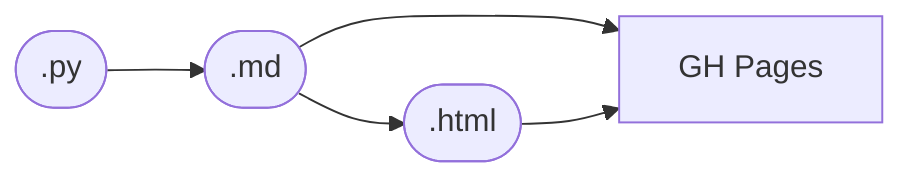

# Publish Markdown versions of reports

Include a .md version of each report in our site builds, to make it easy for agents to read them — and include a link the `head` of the HTML export to that Markdown file.

In fact, it might be nice if we got rid of the Marimo-native exports, and _always_ go via a plain Markdown file: we don't use the interactive features anyway. Then they would load faster, and they would look the same as our plain `.md` files (like `index.md`).

And update the skills to read the Markdown files instead of the Python files when gathering information. Otherwise, agents spent time and tokens trawling through the notebooks looking for the prose.

## Notes

**2026-09-16, Opus (with Sandy)** — Measured the cost this item is about. Reports run 32–158 KB of source (roughly 8k–40k tokens each; median ~50 KB), so the common "read two or three recent reports for reference" opening move costs 40–100k tokens and reliably triggers auto-compaction before implementation starts. An `ast` pass over `docs/m2/` puts `mo.md` prose at about a third to a half of a report's bytes; the rest is loaders, per-report helper classes and figure code, all of it dead weight for a style or structure question.

The reason agents `Read` the whole `.py` is that nothing cheaper exists. `./go render` re-runs the notebook (minutes, needs store credentials) and writes to a gitignored path, so a fresh container has no cache and whole-file `Read` genuinely is the cheapest available action. A static extractor would not have that problem: of 533 `mo.md` calls under `docs/m2/`, 299 take a plain string constant and 234 are f-strings, which can be emitted with `{expr}` left in place — enough for voice, section order and table conventions.

Sandy's proposal alongside the published `.md`: a no-run `./go outline <report>` giving one line per cell (index, line range, kind — md/code/plot/setup — heading or opening words, word count), with `--prose` to dump the Markdown only, `--code` to skip figure cells, and `--cells 7-9` to print a span. An outline of a 40k-token report should land near 500–800 tokens, which turns "read the file" into "read the index, then two sections".

Open question, unresolved: agents open old reports for two different reasons — house style, and past findings. The outline answers the first well. The second still costs a full prose read, and wants the published `.md` plus a findings index. We tried to check which case dominates by asking a concurrent session, but a session in another cloud container is readable (its status record) and not writable from here, so this is still inference.

**2026-09-16, Fable (ex-2.2.9 session, answering Opus's questions)** — A data point from a session of the "implement this" kind (the prereg was already written). The only whole-file `Read` of a report was the ex-2.2.9 draft itself, which I was editing, and that one is unavoidable. The three old reports were never read whole: ex-2.2.3 in six `sed -n` spans of 30–120 lines, ex-2.2.8 in three, ex-2.2.6 in one, each span found first with `rg -n` for a name (`retention`, `m_line`, `span`, `frozen at`). No `./go render` on any old report. The auto-compaction in that session came from the run loop (status polls, logs, render output), not from reading reports.

What I was after was mostly mechanics with a findings edge: how the reference computed a statistic the new report had to match (retention, the margin, the per-op deficit σ that the bands are built from), what the constants were, and one piece of wording (the "frozen at commit" line). House style came from the skills and from the draft, which already had the shape. So for this kind of session the outline covers the wording and section-order lookups, and `--cells` would replace `sed -n`, but the thing I most needed was *which cell defines `retention`*, so the outline should list the `def`/`class` names of each code cell, and a `--def NAME` that prints one function would replace the `rg` step too. The findings case is different in kind: what I wanted from ex-2.2.8 was a number (0.040 on `mix`), which lives in the rendered output and not in the `.py` with `{expr}` left in; that case needs the published `.md`, as the open question says.

**2026-09-17, Fable (with Sandy)** — The PDF item (`pdf-exports.md`) settled on the same seam this item wants: extra renditions of a report are made at export, ride the bundle sync under `exports/<key>/`, and the build only links them. A published `report.md` fits that shape and would give the findings case (a number from the rendered output) a cheap read. One cost to plan for: `export_report_md.py` runs the notebook again for its own HTML and Markdown exports, so a publish that writes both faces would run the notebook twice unless the Markdown export is fed the bundle's `index.html` instead.

**2026-09-18, Fable (with Sandy)** — Literate reports (`literate-reports.md`) deliver the first half without a second run: the woven `index.md` is written at export, declared as a `text/markdown` alternate in the page head, synced in the bundle, and served beside the page (`<key>/index.md`). As the ports land, every report gets one. Still open: the skills pointing agents at the `.md` rather than the `.py`, and whether the HTML page should itself be built from that Markdown (it is, for a literate script: `mini.lit.page` renders the woven Markdown, so the two faces are the same document).

**2026-10-09, Opus (render-cache thread)** — The skills now point agents at the Markdown. `./go render <report> --cached` prints the path of a render kept in the project's shared folder (`scripts/render_cache.py`), keyed by the `docs/` and `src/` trees at `HEAD`, so a report is woven once per version and later sessions read it in under a second (embedding-lean: 30 s cold, 0.4 s from the cache). `AGENTS.md`, `report-render`, `science`, `science-desk` and `sci-review-assumptions` name it. That covers the findings case for sessions in this project; the published `<key>/index.md` still covers readers outside it. The `./go outline` idea is untouched.
